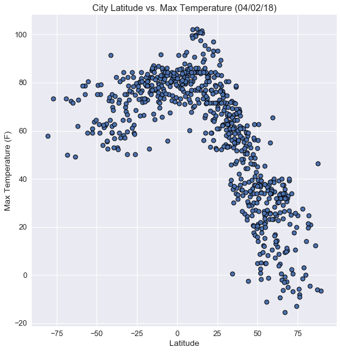
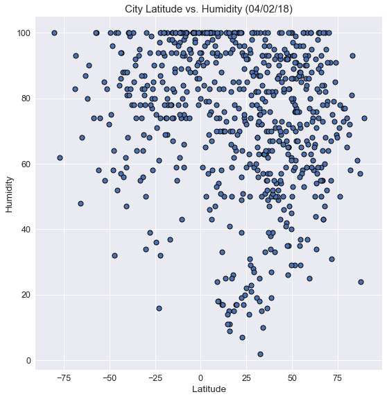
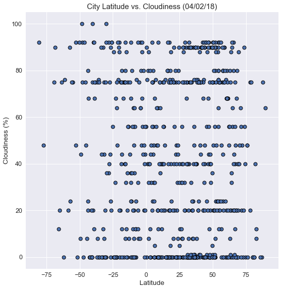
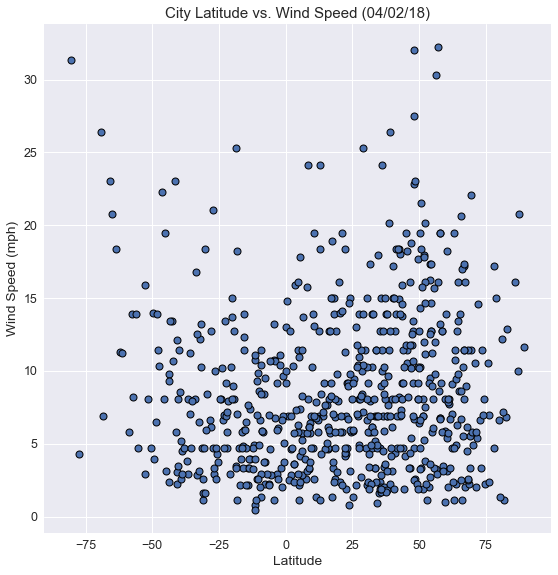

# WeatherPy

## Analysis: 
-  Max temp is highest the closer the city is to the equator. Temperatures are also lower the further north the city is from the equator than cities equidistant south of the equator
-  Humidity > 50% is prevalent for cities between latitues -50 to 75.
-  Higher wind speeds are found north of the equator.
    


```python
# Import Dependencies 
import pandas as pd
import matplotlib.pyplot as plt
import openweathermapy.core as owm
import random
import numpy as np
import seaborn as sns
import urllib
from urllib.error import HTTPError
from citipy import citipy
from config import api_key
from random import uniform
from datetime import datetime

# Query URL
url = "http://api.openweathermap.org/data/2.5/weather?"
query_url = f"{url}appid=api_key&units=&q="

# Create output csv file
output_csv = "city_weather.csv"
    
```

## Generate Cities List


```python
# Create lists for latitude and longitude

lat = []
lon = []

# Use random.uniform to generate random latitude and longitude values
for x in range(2000):
    lat.append(random.uniform(-90,90))
    lon.append(random.uniform(-180,180))
    
# Use citipy to define city and country from coordinates
# Create a new df

cities_df = pd.DataFrame({"Latitude": lat, "Longitude": lon, "City":""})

for index,row in cities_df.iterrows():
    city = citipy.nearest_city(row['Latitude'], row['Longitude'])
    cities_df.at[index,"City"] = (f"{city.city_name},{city.country_code}")
    
    
# Drop duplicates if any
cities_df = cities_df.drop_duplicates(["City"], keep='first')
cities_df = cities_df.reset_index(drop=True)

```

## Perform API Calls


```python
# Create settings parameters
settings = {"units": "imperial", "appid": api_key}

# Run API calls and collect data
params = ['name','clouds.all','sys.country','dt','main.humidity','main.temp','wind.speed']


for index,row in cities_df.iterrows():
    try:
        city = row['City']
        data = owm.get_current(city, **settings)
        results = data(*params)
        cities_df.at[index,'City'] = (results[0])
        cities_df.at[index,'Cloudiness'] = (int(results[1]))
        cities_df.at[index,'Country'] = (results[2])
        cities_df.at[index,'Date'] = (results[3])
        cities_df.at[index,'Humidity'] = (int(results[4]))
        #cities_df.at[index,'Lng'] = (results[5])
        cities_df.at[index,'Max Temp'] = (results[5])     
        cities_df.at[index,'Wind Speed'] = (results[6])
        print(f"Retrieving Results for Index {index}: {city}.")
        print(f"{url} + {query_url}")
    # Skip the city if an error is encountered
    except(HTTPError): 
        print(f"Processing Record {index}: {city}")
        print(f"Missing field/result for {row['City']}. Skipping.")
        pass
    
# Print notification when complete
print("----------------------------")
print("Data Retrieval Complete     ")
```

    Retrieving Results for Index 0: kurchum,kz.
    http://api.openweathermap.org/data/2.5/weather? + http://api.openweathermap.org/data/2.5/weather?appid=api_key&units=&q=
    Retrieving Results for Index 1: albany,au.
    http://api.openweathermap.org/data/2.5/weather? + http://api.openweathermap.org/data/2.5/weather?appid=api_key&units=&q=
    Retrieving Results for Index 2: bilma,ne.
    http://api.openweathermap.org/data/2.5/weather? + http://api.openweathermap.org/data/2.5/weather?appid=api_key&units=&q=
    Retrieving Results for Index 3: quatre cocos,mu.
    http://api.openweathermap.org/data/2.5/weather? + http://api.openweathermap.org/data/2.5/weather?appid=api_key&units=&q=
    Retrieving Results for Index 4: carnarvon,au.
    http://api.openweathermap.org/data/2.5/weather? + http://api.openweathermap.org/data/2.5/weather?appid=api_key&units=&q=
    Retrieving Results for Index 5: rikitea,pf.
    http://api.openweathermap.org/data/2.5/weather? + http://api.openweathermap.org/data/2.5/weather?appid=api_key&units=&q=
    Retrieving Results for Index 6: hilo,us.
    http://api.openweathermap.org/data/2.5/weather? + http://api.openweathermap.org/data/2.5/weather?appid=api_key&units=&q=
    Retrieving Results for Index 7: vao,nc.
    http://api.openweathermap.org/data/2.5/weather? + http://api.openweathermap.org/data/2.5/weather?appid=api_key&units=&q=
    Retrieving Results for Index 8: thompson,ca.
    http://api.openweathermap.org/data/2.5/weather? + http://api.openweathermap.org/data/2.5/weather?appid=api_key&units=&q=
    Retrieving Results for Index 9: atuona,pf.
    http://api.openweathermap.org/data/2.5/weather? + http://api.openweathermap.org/data/2.5/weather?appid=api_key&units=&q=
    Retrieving Results for Index 10: mar del plata,ar.
    http://api.openweathermap.org/data/2.5/weather? + http://api.openweathermap.org/data/2.5/weather?appid=api_key&units=&q=
    Retrieving Results for Index 11: nikolskoye,ru.
    http://api.openweathermap.org/data/2.5/weather? + http://api.openweathermap.org/data/2.5/weather?appid=api_key&units=&q=
    Retrieving Results for Index 12: marsh harbour,bs.
    http://api.openweathermap.org/data/2.5/weather? + http://api.openweathermap.org/data/2.5/weather?appid=api_key&units=&q=
    Processing Record 13: halalo,wf
    Missing field/result for halalo,wf. Skipping.
    Retrieving Results for Index 14: nador,ma.
    http://api.openweathermap.org/data/2.5/weather? + http://api.openweathermap.org/data/2.5/weather?appid=api_key&units=&q=
    Retrieving Results for Index 15: alofi,nu.
    http://api.openweathermap.org/data/2.5/weather? + http://api.openweathermap.org/data/2.5/weather?appid=api_key&units=&q=
    Retrieving Results for Index 16: ushuaia,ar.
    http://api.openweathermap.org/data/2.5/weather? + http://api.openweathermap.org/data/2.5/weather?appid=api_key&units=&q=
    Retrieving Results for Index 17: port elizabeth,za.
    http://api.openweathermap.org/data/2.5/weather? + http://api.openweathermap.org/data/2.5/weather?appid=api_key&units=&q=
    Retrieving Results for Index 18: cape town,za.
    http://api.openweathermap.org/data/2.5/weather? + http://api.openweathermap.org/data/2.5/weather?appid=api_key&units=&q=
    Retrieving Results for Index 19: tanout,ne.
    http://api.openweathermap.org/data/2.5/weather? + http://api.openweathermap.org/data/2.5/weather?appid=api_key&units=&q=
    Retrieving Results for Index 20: limbang,my.
    http://api.openweathermap.org/data/2.5/weather? + http://api.openweathermap.org/data/2.5/weather?appid=api_key&units=&q=
    Retrieving Results for Index 21: santa rosa,bo.
    http://api.openweathermap.org/data/2.5/weather? + http://api.openweathermap.org/data/2.5/weather?appid=api_key&units=&q=
    Retrieving Results for Index 22: onega,ru.
    http://api.openweathermap.org/data/2.5/weather? + http://api.openweathermap.org/data/2.5/weather?appid=api_key&units=&q=
    Retrieving Results for Index 23: punta arenas,cl.
    http://api.openweathermap.org/data/2.5/weather? + http://api.openweathermap.org/data/2.5/weather?appid=api_key&units=&q=
    Retrieving Results for Index 24: macapa,br.
    http://api.openweathermap.org/data/2.5/weather? + http://api.openweathermap.org/data/2.5/weather?appid=api_key&units=&q=
    Retrieving Results for Index 25: concordia,ar.
    http://api.openweathermap.org/data/2.5/weather? + http://api.openweathermap.org/data/2.5/weather?appid=api_key&units=&q=
    Retrieving Results for Index 26: sitka,us.
    http://api.openweathermap.org/data/2.5/weather? + http://api.openweathermap.org/data/2.5/weather?appid=api_key&units=&q=
    Retrieving Results for Index 27: grua,no.
    http://api.openweathermap.org/data/2.5/weather? + http://api.openweathermap.org/data/2.5/weather?appid=api_key&units=&q=
    Retrieving Results for Index 28: busselton,au.
    http://api.openweathermap.org/data/2.5/weather? + http://api.openweathermap.org/data/2.5/weather?appid=api_key&units=&q=
    Retrieving Results for Index 29: hambantota,lk.
    http://api.openweathermap.org/data/2.5/weather? + http://api.openweathermap.org/data/2.5/weather?appid=api_key&units=&q=
    Retrieving Results for Index 30: northam,au.
    http://api.openweathermap.org/data/2.5/weather? + http://api.openweathermap.org/data/2.5/weather?appid=api_key&units=&q=
    Retrieving Results for Index 31: baykit,ru.
    http://api.openweathermap.org/data/2.5/weather? + http://api.openweathermap.org/data/2.5/weather?appid=api_key&units=&q=
    Retrieving Results for Index 32: saldanha,za.
    http://api.openweathermap.org/data/2.5/weather? + http://api.openweathermap.org/data/2.5/weather?appid=api_key&units=&q=
    Retrieving Results for Index 33: sao filipe,cv.
    http://api.openweathermap.org/data/2.5/weather? + http://api.openweathermap.org/data/2.5/weather?appid=api_key&units=&q=
    Retrieving Results for Index 34: bredasdorp,za.
    http://api.openweathermap.org/data/2.5/weather? + http://api.openweathermap.org/data/2.5/weather?appid=api_key&units=&q=
    Retrieving Results for Index 35: severo-kurilsk,ru.
    http://api.openweathermap.org/data/2.5/weather? + http://api.openweathermap.org/data/2.5/weather?appid=api_key&units=&q=
    Retrieving Results for Index 36: amahai,id.
    http://api.openweathermap.org/data/2.5/weather? + http://api.openweathermap.org/data/2.5/weather?appid=api_key&units=&q=
    Retrieving Results for Index 37: puerto ayora,ec.
    http://api.openweathermap.org/data/2.5/weather? + http://api.openweathermap.org/data/2.5/weather?appid=api_key&units=&q=
    Retrieving Results for Index 38: kavieng,pg.
    http://api.openweathermap.org/data/2.5/weather? + http://api.openweathermap.org/data/2.5/weather?appid=api_key&units=&q=
    Retrieving Results for Index 39: taitung,tw.
    http://api.openweathermap.org/data/2.5/weather? + http://api.openweathermap.org/data/2.5/weather?appid=api_key&units=&q=
    Retrieving Results for Index 40: the valley,ai.
    http://api.openweathermap.org/data/2.5/weather? + http://api.openweathermap.org/data/2.5/weather?appid=api_key&units=&q=
    Retrieving Results for Index 41: isangel,vu.
    http://api.openweathermap.org/data/2.5/weather? + http://api.openweathermap.org/data/2.5/weather?appid=api_key&units=&q=
    Retrieving Results for Index 42: ancud,cl.
    http://api.openweathermap.org/data/2.5/weather? + http://api.openweathermap.org/data/2.5/weather?appid=api_key&units=&q=
    Retrieving Results for Index 43: kirakira,sb.
    http://api.openweathermap.org/data/2.5/weather? + http://api.openweathermap.org/data/2.5/weather?appid=api_key&units=&q=
    Retrieving Results for Index 44: saveh,ir.
    http://api.openweathermap.org/data/2.5/weather? + http://api.openweathermap.org/data/2.5/weather?appid=api_key&units=&q=
    Retrieving Results for Index 45: udachnyy,ru.
    http://api.openweathermap.org/data/2.5/weather? + http://api.openweathermap.org/data/2.5/weather?appid=api_key&units=&q=
    Retrieving Results for Index 46: dolinsk,ru.
    http://api.openweathermap.org/data/2.5/weather? + http://api.openweathermap.org/data/2.5/weather?appid=api_key&units=&q=
    Retrieving Results for Index 47: kapaa,us.
    http://api.openweathermap.org/data/2.5/weather? + http://api.openweathermap.org/data/2.5/weather?appid=api_key&units=&q=
    Retrieving Results for Index 48: east london,za.
    http://api.openweathermap.org/data/2.5/weather? + http://api.openweathermap.org/data/2.5/weather?appid=api_key&units=&q=
    Retrieving Results for Index 49: njombe,tz.
    http://api.openweathermap.org/data/2.5/weather? + http://api.openweathermap.org/data/2.5/weather?appid=api_key&units=&q=
    Retrieving Results for Index 50: chuy,uy.
    http://api.openweathermap.org/data/2.5/weather? + http://api.openweathermap.org/data/2.5/weather?appid=api_key&units=&q=
    Retrieving Results for Index 51: korla,cn.
    http://api.openweathermap.org/data/2.5/weather? + http://api.openweathermap.org/data/2.5/weather?appid=api_key&units=&q=
    Processing Record 52: taolanaro,mg
    Missing field/result for taolanaro,mg. Skipping.
    Retrieving Results for Index 53: yellowknife,ca.
    http://api.openweathermap.org/data/2.5/weather? + http://api.openweathermap.org/data/2.5/weather?appid=api_key&units=&q=
    Retrieving Results for Index 54: shingu,jp.
    http://api.openweathermap.org/data/2.5/weather? + http://api.openweathermap.org/data/2.5/weather?appid=api_key&units=&q=
    Retrieving Results for Index 55: gejiu,cn.
    http://api.openweathermap.org/data/2.5/weather? + http://api.openweathermap.org/data/2.5/weather?appid=api_key&units=&q=
    Retrieving Results for Index 56: dubbo,au.
    http://api.openweathermap.org/data/2.5/weather? + http://api.openweathermap.org/data/2.5/weather?appid=api_key&units=&q=
    Retrieving Results for Index 57: butaritari,ki.
    http://api.openweathermap.org/data/2.5/weather? + http://api.openweathermap.org/data/2.5/weather?appid=api_key&units=&q=
    Retrieving Results for Index 58: tuatapere,nz.
    http://api.openweathermap.org/data/2.5/weather? + http://api.openweathermap.org/data/2.5/weather?appid=api_key&units=&q=
    Retrieving Results for Index 59: salur,in.
    http://api.openweathermap.org/data/2.5/weather? + http://api.openweathermap.org/data/2.5/weather?appid=api_key&units=&q=
    Processing Record 60: bolungarvik,is
    Missing field/result for bolungarvik,is. Skipping.
    Retrieving Results for Index 61: svetlaya,ru.
    http://api.openweathermap.org/data/2.5/weather? + http://api.openweathermap.org/data/2.5/weather?appid=api_key&units=&q=
    Retrieving Results for Index 62: znamenskoye,ru.
    http://api.openweathermap.org/data/2.5/weather? + http://api.openweathermap.org/data/2.5/weather?appid=api_key&units=&q=
    Retrieving Results for Index 63: hithadhoo,mv.
    http://api.openweathermap.org/data/2.5/weather? + http://api.openweathermap.org/data/2.5/weather?appid=api_key&units=&q=
    Retrieving Results for Index 64: novonikolayevskaya,ru.
    http://api.openweathermap.org/data/2.5/weather? + http://api.openweathermap.org/data/2.5/weather?appid=api_key&units=&q=
    Retrieving Results for Index 65: cerritos,mx.
    http://api.openweathermap.org/data/2.5/weather? + http://api.openweathermap.org/data/2.5/weather?appid=api_key&units=&q=
    Processing Record 66: mataura,pf
    Missing field/result for mataura,pf. Skipping.
    Retrieving Results for Index 67: broome,au.
    http://api.openweathermap.org/data/2.5/weather? + http://api.openweathermap.org/data/2.5/weather?appid=api_key&units=&q=
    Retrieving Results for Index 68: zhigansk,ru.
    http://api.openweathermap.org/data/2.5/weather? + http://api.openweathermap.org/data/2.5/weather?appid=api_key&units=&q=
    Retrieving Results for Index 69: iqaluit,ca.
    http://api.openweathermap.org/data/2.5/weather? + http://api.openweathermap.org/data/2.5/weather?appid=api_key&units=&q=
    Retrieving Results for Index 70: clyde river,ca.
    http://api.openweathermap.org/data/2.5/weather? + http://api.openweathermap.org/data/2.5/weather?appid=api_key&units=&q=
    Retrieving Results for Index 71: souillac,mu.
    http://api.openweathermap.org/data/2.5/weather? + http://api.openweathermap.org/data/2.5/weather?appid=api_key&units=&q=
    Processing Record 72: sentyabrskiy,ru
    Missing field/result for sentyabrskiy,ru. Skipping.
    Retrieving Results for Index 73: champerico,gt.
    http://api.openweathermap.org/data/2.5/weather? + http://api.openweathermap.org/data/2.5/weather?appid=api_key&units=&q=
    Retrieving Results for Index 74: bima,id.
    http://api.openweathermap.org/data/2.5/weather? + http://api.openweathermap.org/data/2.5/weather?appid=api_key&units=&q=
    Retrieving Results for Index 75: chokurdakh,ru.
    http://api.openweathermap.org/data/2.5/weather? + http://api.openweathermap.org/data/2.5/weather?appid=api_key&units=&q=
    Processing Record 76: mrirt,ma
    Missing field/result for mrirt,ma. Skipping.
    Retrieving Results for Index 77: ponta do sol,pt.
    http://api.openweathermap.org/data/2.5/weather? + http://api.openweathermap.org/data/2.5/weather?appid=api_key&units=&q=
    Processing Record 78: nizhneyansk,ru
    Missing field/result for nizhneyansk,ru. Skipping.
    Retrieving Results for Index 79: khatanga,ru.
    http://api.openweathermap.org/data/2.5/weather? + http://api.openweathermap.org/data/2.5/weather?appid=api_key&units=&q=
    Processing Record 80: attawapiskat,ca
    Missing field/result for attawapiskat,ca. Skipping.
    Retrieving Results for Index 81: del rio,us.
    http://api.openweathermap.org/data/2.5/weather? + http://api.openweathermap.org/data/2.5/weather?appid=api_key&units=&q=
    Retrieving Results for Index 82: lebu,cl.
    http://api.openweathermap.org/data/2.5/weather? + http://api.openweathermap.org/data/2.5/weather?appid=api_key&units=&q=
    Retrieving Results for Index 83: vaini,to.
    http://api.openweathermap.org/data/2.5/weather? + http://api.openweathermap.org/data/2.5/weather?appid=api_key&units=&q=
    Retrieving Results for Index 84: jamestown,sh.
    http://api.openweathermap.org/data/2.5/weather? + http://api.openweathermap.org/data/2.5/weather?appid=api_key&units=&q=
    Retrieving Results for Index 85: hobart,au.
    http://api.openweathermap.org/data/2.5/weather? + http://api.openweathermap.org/data/2.5/weather?appid=api_key&units=&q=
    Retrieving Results for Index 86: morehead,pg.
    http://api.openweathermap.org/data/2.5/weather? + http://api.openweathermap.org/data/2.5/weather?appid=api_key&units=&q=
    Retrieving Results for Index 87: hermanus,za.
    http://api.openweathermap.org/data/2.5/weather? + http://api.openweathermap.org/data/2.5/weather?appid=api_key&units=&q=
    Retrieving Results for Index 88: wellington,nz.
    http://api.openweathermap.org/data/2.5/weather? + http://api.openweathermap.org/data/2.5/weather?appid=api_key&units=&q=
    Retrieving Results for Index 89: saskylakh,ru.
    http://api.openweathermap.org/data/2.5/weather? + http://api.openweathermap.org/data/2.5/weather?appid=api_key&units=&q=
    Processing Record 90: bengkulu,id
    Missing field/result for bengkulu,id. Skipping.
    Retrieving Results for Index 91: taldan,ru.
    http://api.openweathermap.org/data/2.5/weather? + http://api.openweathermap.org/data/2.5/weather?appid=api_key&units=&q=
    Retrieving Results for Index 92: ribeira grande,pt.
    http://api.openweathermap.org/data/2.5/weather? + http://api.openweathermap.org/data/2.5/weather?appid=api_key&units=&q=
    Retrieving Results for Index 93: yumen,cn.
    http://api.openweathermap.org/data/2.5/weather? + http://api.openweathermap.org/data/2.5/weather?appid=api_key&units=&q=
    Retrieving Results for Index 94: bluff,nz.
    http://api.openweathermap.org/data/2.5/weather? + http://api.openweathermap.org/data/2.5/weather?appid=api_key&units=&q=
    Retrieving Results for Index 95: riyadh,sa.
    http://api.openweathermap.org/data/2.5/weather? + http://api.openweathermap.org/data/2.5/weather?appid=api_key&units=&q=
    Retrieving Results for Index 96: mlonggo,id.
    http://api.openweathermap.org/data/2.5/weather? + http://api.openweathermap.org/data/2.5/weather?appid=api_key&units=&q=
    Retrieving Results for Index 97: upernavik,gl.
    http://api.openweathermap.org/data/2.5/weather? + http://api.openweathermap.org/data/2.5/weather?appid=api_key&units=&q=
    Retrieving Results for Index 98: avarua,ck.
    http://api.openweathermap.org/data/2.5/weather? + http://api.openweathermap.org/data/2.5/weather?appid=api_key&units=&q=
    Processing Record 99: illoqqortoormiut,gl
    Missing field/result for illoqqortoormiut,gl. Skipping.
    Retrieving Results for Index 100: townsville,au.
    http://api.openweathermap.org/data/2.5/weather? + http://api.openweathermap.org/data/2.5/weather?appid=api_key&units=&q=
    Processing Record 101: cumaribo,co
    Missing field/result for cumaribo,co. Skipping.
    Retrieving Results for Index 102: helena,us.
    http://api.openweathermap.org/data/2.5/weather? + http://api.openweathermap.org/data/2.5/weather?appid=api_key&units=&q=
    Retrieving Results for Index 103: myitkyina,mm.
    http://api.openweathermap.org/data/2.5/weather? + http://api.openweathermap.org/data/2.5/weather?appid=api_key&units=&q=
    Retrieving Results for Index 104: nabire,id.
    http://api.openweathermap.org/data/2.5/weather? + http://api.openweathermap.org/data/2.5/weather?appid=api_key&units=&q=
    Retrieving Results for Index 105: puurmani,ee.
    http://api.openweathermap.org/data/2.5/weather? + http://api.openweathermap.org/data/2.5/weather?appid=api_key&units=&q=
    Retrieving Results for Index 106: barrow,us.
    http://api.openweathermap.org/data/2.5/weather? + http://api.openweathermap.org/data/2.5/weather?appid=api_key&units=&q=
    Retrieving Results for Index 107: jiexiu,cn.
    http://api.openweathermap.org/data/2.5/weather? + http://api.openweathermap.org/data/2.5/weather?appid=api_key&units=&q=
    Retrieving Results for Index 108: dunajska streda,sk.
    http://api.openweathermap.org/data/2.5/weather? + http://api.openweathermap.org/data/2.5/weather?appid=api_key&units=&q=
    Retrieving Results for Index 109: nanortalik,gl.
    http://api.openweathermap.org/data/2.5/weather? + http://api.openweathermap.org/data/2.5/weather?appid=api_key&units=&q=
    Retrieving Results for Index 110: santo domingo,ni.
    http://api.openweathermap.org/data/2.5/weather? + http://api.openweathermap.org/data/2.5/weather?appid=api_key&units=&q=
    Retrieving Results for Index 111: santiago del estero,ar.
    http://api.openweathermap.org/data/2.5/weather? + http://api.openweathermap.org/data/2.5/weather?appid=api_key&units=&q=
    Processing Record 112: lasa,cn
    Missing field/result for lasa,cn. Skipping.
    Retrieving Results for Index 113: dali,cn.
    http://api.openweathermap.org/data/2.5/weather? + http://api.openweathermap.org/data/2.5/weather?appid=api_key&units=&q=
    Retrieving Results for Index 114: labuhan,id.
    http://api.openweathermap.org/data/2.5/weather? + http://api.openweathermap.org/data/2.5/weather?appid=api_key&units=&q=
    Retrieving Results for Index 115: havelock,us.
    http://api.openweathermap.org/data/2.5/weather? + http://api.openweathermap.org/data/2.5/weather?appid=api_key&units=&q=
    Retrieving Results for Index 116: walvis bay,na.
    http://api.openweathermap.org/data/2.5/weather? + http://api.openweathermap.org/data/2.5/weather?appid=api_key&units=&q=
    Retrieving Results for Index 117: haines junction,ca.
    http://api.openweathermap.org/data/2.5/weather? + http://api.openweathermap.org/data/2.5/weather?appid=api_key&units=&q=
    Retrieving Results for Index 118: caravelas,br.
    http://api.openweathermap.org/data/2.5/weather? + http://api.openweathermap.org/data/2.5/weather?appid=api_key&units=&q=
    Retrieving Results for Index 119: pedasi,pa.
    http://api.openweathermap.org/data/2.5/weather? + http://api.openweathermap.org/data/2.5/weather?appid=api_key&units=&q=
    Retrieving Results for Index 120: arraial do cabo,br.
    http://api.openweathermap.org/data/2.5/weather? + http://api.openweathermap.org/data/2.5/weather?appid=api_key&units=&q=
    Retrieving Results for Index 121: dikson,ru.
    http://api.openweathermap.org/data/2.5/weather? + http://api.openweathermap.org/data/2.5/weather?appid=api_key&units=&q=
    Processing Record 122: airai,pw
    Missing field/result for airai,pw. Skipping.
    Retrieving Results for Index 123: arkhangelskoye,ru.
    http://api.openweathermap.org/data/2.5/weather? + http://api.openweathermap.org/data/2.5/weather?appid=api_key&units=&q=
    Retrieving Results for Index 124: san patricio,mx.
    http://api.openweathermap.org/data/2.5/weather? + http://api.openweathermap.org/data/2.5/weather?appid=api_key&units=&q=
    Processing Record 125: belushya guba,ru
    Missing field/result for belushya guba,ru. Skipping.
    Processing Record 126: bolshiye uki,ru
    Missing field/result for bolshiye uki,ru. Skipping.
    Retrieving Results for Index 127: beausejour,ca.
    http://api.openweathermap.org/data/2.5/weather? + http://api.openweathermap.org/data/2.5/weather?appid=api_key&units=&q=
    Retrieving Results for Index 128: maceio,br.
    http://api.openweathermap.org/data/2.5/weather? + http://api.openweathermap.org/data/2.5/weather?appid=api_key&units=&q=
    Retrieving Results for Index 129: tasiilaq,gl.
    http://api.openweathermap.org/data/2.5/weather? + http://api.openweathermap.org/data/2.5/weather?appid=api_key&units=&q=
    Retrieving Results for Index 130: vallenar,cl.
    http://api.openweathermap.org/data/2.5/weather? + http://api.openweathermap.org/data/2.5/weather?appid=api_key&units=&q=
    Retrieving Results for Index 131: kaitangata,nz.
    http://api.openweathermap.org/data/2.5/weather? + http://api.openweathermap.org/data/2.5/weather?appid=api_key&units=&q=
    Retrieving Results for Index 132: bethel,us.
    http://api.openweathermap.org/data/2.5/weather? + http://api.openweathermap.org/data/2.5/weather?appid=api_key&units=&q=
    Retrieving Results for Index 133: ilulissat,gl.
    http://api.openweathermap.org/data/2.5/weather? + http://api.openweathermap.org/data/2.5/weather?appid=api_key&units=&q=
    Retrieving Results for Index 134: batemans bay,au.
    http://api.openweathermap.org/data/2.5/weather? + http://api.openweathermap.org/data/2.5/weather?appid=api_key&units=&q=
    Retrieving Results for Index 135: sabha,ly.
    http://api.openweathermap.org/data/2.5/weather? + http://api.openweathermap.org/data/2.5/weather?appid=api_key&units=&q=
    Processing Record 136: umm durman,sd
    Missing field/result for umm durman,sd. Skipping.
    Retrieving Results for Index 137: pevek,ru.
    http://api.openweathermap.org/data/2.5/weather? + http://api.openweathermap.org/data/2.5/weather?appid=api_key&units=&q=
    Retrieving Results for Index 138: georgetown,sh.
    http://api.openweathermap.org/data/2.5/weather? + http://api.openweathermap.org/data/2.5/weather?appid=api_key&units=&q=
    Retrieving Results for Index 139: talnakh,ru.
    http://api.openweathermap.org/data/2.5/weather? + http://api.openweathermap.org/data/2.5/weather?appid=api_key&units=&q=
    Retrieving Results for Index 140: srednekolymsk,ru.
    http://api.openweathermap.org/data/2.5/weather? + http://api.openweathermap.org/data/2.5/weather?appid=api_key&units=&q=
    Retrieving Results for Index 141: phalaborwa,za.
    http://api.openweathermap.org/data/2.5/weather? + http://api.openweathermap.org/data/2.5/weather?appid=api_key&units=&q=
    Retrieving Results for Index 142: deputatskiy,ru.
    http://api.openweathermap.org/data/2.5/weather? + http://api.openweathermap.org/data/2.5/weather?appid=api_key&units=&q=
    Retrieving Results for Index 143: mercedes,ar.
    http://api.openweathermap.org/data/2.5/weather? + http://api.openweathermap.org/data/2.5/weather?appid=api_key&units=&q=
    Retrieving Results for Index 144: linqiong,cn.
    http://api.openweathermap.org/data/2.5/weather? + http://api.openweathermap.org/data/2.5/weather?appid=api_key&units=&q=
    Retrieving Results for Index 145: pizarro,co.
    http://api.openweathermap.org/data/2.5/weather? + http://api.openweathermap.org/data/2.5/weather?appid=api_key&units=&q=
    Retrieving Results for Index 146: san juan,ar.
    http://api.openweathermap.org/data/2.5/weather? + http://api.openweathermap.org/data/2.5/weather?appid=api_key&units=&q=
    Retrieving Results for Index 147: leningradskiy,ru.
    http://api.openweathermap.org/data/2.5/weather? + http://api.openweathermap.org/data/2.5/weather?appid=api_key&units=&q=
    Retrieving Results for Index 148: miles city,us.
    http://api.openweathermap.org/data/2.5/weather? + http://api.openweathermap.org/data/2.5/weather?appid=api_key&units=&q=
    Retrieving Results for Index 149: tuktoyaktuk,ca.
    http://api.openweathermap.org/data/2.5/weather? + http://api.openweathermap.org/data/2.5/weather?appid=api_key&units=&q=
    Retrieving Results for Index 150: cidreira,br.
    http://api.openweathermap.org/data/2.5/weather? + http://api.openweathermap.org/data/2.5/weather?appid=api_key&units=&q=
    Retrieving Results for Index 151: caraballeda,ve.
    http://api.openweathermap.org/data/2.5/weather? + http://api.openweathermap.org/data/2.5/weather?appid=api_key&units=&q=
    Retrieving Results for Index 152: lagoa,pt.
    http://api.openweathermap.org/data/2.5/weather? + http://api.openweathermap.org/data/2.5/weather?appid=api_key&units=&q=
    Retrieving Results for Index 153: san carlos de bariloche,ar.
    http://api.openweathermap.org/data/2.5/weather? + http://api.openweathermap.org/data/2.5/weather?appid=api_key&units=&q=
    Retrieving Results for Index 154: tautira,pf.
    http://api.openweathermap.org/data/2.5/weather? + http://api.openweathermap.org/data/2.5/weather?appid=api_key&units=&q=
    Retrieving Results for Index 155: pangnirtung,ca.
    http://api.openweathermap.org/data/2.5/weather? + http://api.openweathermap.org/data/2.5/weather?appid=api_key&units=&q=
    Retrieving Results for Index 156: novyy urengoy,ru.
    http://api.openweathermap.org/data/2.5/weather? + http://api.openweathermap.org/data/2.5/weather?appid=api_key&units=&q=
    Processing Record 157: codrington,ag
    Missing field/result for codrington,ag. Skipping.
    Processing Record 158: burica,pa
    Missing field/result for burica,pa. Skipping.
    Retrieving Results for Index 159: lubuagan,ph.
    http://api.openweathermap.org/data/2.5/weather? + http://api.openweathermap.org/data/2.5/weather?appid=api_key&units=&q=
    Retrieving Results for Index 160: aklavik,ca.
    http://api.openweathermap.org/data/2.5/weather? + http://api.openweathermap.org/data/2.5/weather?appid=api_key&units=&q=
    Processing Record 161: kuche,cn
    Missing field/result for kuche,cn. Skipping.
    Processing Record 162: tubruq,ly
    Missing field/result for tubruq,ly. Skipping.
    Retrieving Results for Index 163: coquimbo,cl.
    http://api.openweathermap.org/data/2.5/weather? + http://api.openweathermap.org/data/2.5/weather?appid=api_key&units=&q=
    Retrieving Results for Index 164: wanaka,nz.
    http://api.openweathermap.org/data/2.5/weather? + http://api.openweathermap.org/data/2.5/weather?appid=api_key&units=&q=
    Retrieving Results for Index 165: torbay,ca.
    http://api.openweathermap.org/data/2.5/weather? + http://api.openweathermap.org/data/2.5/weather?appid=api_key&units=&q=
    Retrieving Results for Index 166: faanui,pf.
    http://api.openweathermap.org/data/2.5/weather? + http://api.openweathermap.org/data/2.5/weather?appid=api_key&units=&q=
    Retrieving Results for Index 167: xinyang,cn.
    http://api.openweathermap.org/data/2.5/weather? + http://api.openweathermap.org/data/2.5/weather?appid=api_key&units=&q=
    Retrieving Results for Index 168: mount isa,au.
    http://api.openweathermap.org/data/2.5/weather? + http://api.openweathermap.org/data/2.5/weather?appid=api_key&units=&q=
    Retrieving Results for Index 169: vostok,ru.
    http://api.openweathermap.org/data/2.5/weather? + http://api.openweathermap.org/data/2.5/weather?appid=api_key&units=&q=
    Retrieving Results for Index 170: elko,us.
    http://api.openweathermap.org/data/2.5/weather? + http://api.openweathermap.org/data/2.5/weather?appid=api_key&units=&q=
    Retrieving Results for Index 171: mahebourg,mu.
    http://api.openweathermap.org/data/2.5/weather? + http://api.openweathermap.org/data/2.5/weather?appid=api_key&units=&q=
    Retrieving Results for Index 172: kiruna,se.
    http://api.openweathermap.org/data/2.5/weather? + http://api.openweathermap.org/data/2.5/weather?appid=api_key&units=&q=
    Retrieving Results for Index 173: qaanaaq,gl.
    http://api.openweathermap.org/data/2.5/weather? + http://api.openweathermap.org/data/2.5/weather?appid=api_key&units=&q=
    Processing Record 174: barentsburg,sj
    Missing field/result for barentsburg,sj. Skipping.
    Retrieving Results for Index 175: aykhal,ru.
    http://api.openweathermap.org/data/2.5/weather? + http://api.openweathermap.org/data/2.5/weather?appid=api_key&units=&q=
    Retrieving Results for Index 176: bardiyah,ly.
    http://api.openweathermap.org/data/2.5/weather? + http://api.openweathermap.org/data/2.5/weather?appid=api_key&units=&q=
    Retrieving Results for Index 177: maragogi,br.
    http://api.openweathermap.org/data/2.5/weather? + http://api.openweathermap.org/data/2.5/weather?appid=api_key&units=&q=
    Retrieving Results for Index 178: port alfred,za.
    http://api.openweathermap.org/data/2.5/weather? + http://api.openweathermap.org/data/2.5/weather?appid=api_key&units=&q=
    Retrieving Results for Index 179: meadow lake,ca.
    http://api.openweathermap.org/data/2.5/weather? + http://api.openweathermap.org/data/2.5/weather?appid=api_key&units=&q=
    Retrieving Results for Index 180: aleksandrov gay,ru.
    http://api.openweathermap.org/data/2.5/weather? + http://api.openweathermap.org/data/2.5/weather?appid=api_key&units=&q=
    Retrieving Results for Index 181: nouakchott,mr.
    http://api.openweathermap.org/data/2.5/weather? + http://api.openweathermap.org/data/2.5/weather?appid=api_key&units=&q=
    Retrieving Results for Index 182: oistins,bb.
    http://api.openweathermap.org/data/2.5/weather? + http://api.openweathermap.org/data/2.5/weather?appid=api_key&units=&q=
    Retrieving Results for Index 183: katsuura,jp.
    http://api.openweathermap.org/data/2.5/weather? + http://api.openweathermap.org/data/2.5/weather?appid=api_key&units=&q=
    Retrieving Results for Index 184: viedma,ar.
    http://api.openweathermap.org/data/2.5/weather? + http://api.openweathermap.org/data/2.5/weather?appid=api_key&units=&q=
    Retrieving Results for Index 185: husavik,is.
    http://api.openweathermap.org/data/2.5/weather? + http://api.openweathermap.org/data/2.5/weather?appid=api_key&units=&q=
    Retrieving Results for Index 186: saint-philippe,re.
    http://api.openweathermap.org/data/2.5/weather? + http://api.openweathermap.org/data/2.5/weather?appid=api_key&units=&q=
    Retrieving Results for Index 187: provideniya,ru.
    http://api.openweathermap.org/data/2.5/weather? + http://api.openweathermap.org/data/2.5/weather?appid=api_key&units=&q=
    Retrieving Results for Index 188: kultuk,ru.
    http://api.openweathermap.org/data/2.5/weather? + http://api.openweathermap.org/data/2.5/weather?appid=api_key&units=&q=
    Retrieving Results for Index 189: mount gambier,au.
    http://api.openweathermap.org/data/2.5/weather? + http://api.openweathermap.org/data/2.5/weather?appid=api_key&units=&q=
    Retrieving Results for Index 190: susanville,us.
    http://api.openweathermap.org/data/2.5/weather? + http://api.openweathermap.org/data/2.5/weather?appid=api_key&units=&q=
    Retrieving Results for Index 191: teya,ru.
    http://api.openweathermap.org/data/2.5/weather? + http://api.openweathermap.org/data/2.5/weather?appid=api_key&units=&q=
    Processing Record 192: tsihombe,mg
    Missing field/result for tsihombe,mg. Skipping.
    Retrieving Results for Index 193: moron,mn.
    http://api.openweathermap.org/data/2.5/weather? + http://api.openweathermap.org/data/2.5/weather?appid=api_key&units=&q=
    Retrieving Results for Index 194: podgornoye,ru.
    http://api.openweathermap.org/data/2.5/weather? + http://api.openweathermap.org/data/2.5/weather?appid=api_key&units=&q=
    Processing Record 195: ngukurr,au
    Missing field/result for ngukurr,au. Skipping.
    Retrieving Results for Index 196: nemuro,jp.
    http://api.openweathermap.org/data/2.5/weather? + http://api.openweathermap.org/data/2.5/weather?appid=api_key&units=&q=
    Retrieving Results for Index 197: honiara,sb.
    http://api.openweathermap.org/data/2.5/weather? + http://api.openweathermap.org/data/2.5/weather?appid=api_key&units=&q=
    Retrieving Results for Index 198: san cristobal,ec.
    http://api.openweathermap.org/data/2.5/weather? + http://api.openweathermap.org/data/2.5/weather?appid=api_key&units=&q=
    Retrieving Results for Index 199: santa vitoria do palmar,br.
    http://api.openweathermap.org/data/2.5/weather? + http://api.openweathermap.org/data/2.5/weather?appid=api_key&units=&q=
    Retrieving Results for Index 200: betare oya,cm.
    http://api.openweathermap.org/data/2.5/weather? + http://api.openweathermap.org/data/2.5/weather?appid=api_key&units=&q=
    Retrieving Results for Index 201: shenjiamen,cn.
    http://api.openweathermap.org/data/2.5/weather? + http://api.openweathermap.org/data/2.5/weather?appid=api_key&units=&q=
    Retrieving Results for Index 202: ostrovnoy,ru.
    http://api.openweathermap.org/data/2.5/weather? + http://api.openweathermap.org/data/2.5/weather?appid=api_key&units=&q=
    Retrieving Results for Index 203: cabo san lucas,mx.
    http://api.openweathermap.org/data/2.5/weather? + http://api.openweathermap.org/data/2.5/weather?appid=api_key&units=&q=
    Processing Record 204: marcona,pe
    Missing field/result for marcona,pe. Skipping.
    Retrieving Results for Index 205: puerto madryn,ar.
    http://api.openweathermap.org/data/2.5/weather? + http://api.openweathermap.org/data/2.5/weather?appid=api_key&units=&q=
    Retrieving Results for Index 206: tabou,ci.
    http://api.openweathermap.org/data/2.5/weather? + http://api.openweathermap.org/data/2.5/weather?appid=api_key&units=&q=
    Retrieving Results for Index 207: jizan,sa.
    http://api.openweathermap.org/data/2.5/weather? + http://api.openweathermap.org/data/2.5/weather?appid=api_key&units=&q=
    Retrieving Results for Index 208: geraldton,au.
    http://api.openweathermap.org/data/2.5/weather? + http://api.openweathermap.org/data/2.5/weather?appid=api_key&units=&q=
    Retrieving Results for Index 209: sobolevo,ru.
    http://api.openweathermap.org/data/2.5/weather? + http://api.openweathermap.org/data/2.5/weather?appid=api_key&units=&q=
    Retrieving Results for Index 210: tetouan,ma.
    http://api.openweathermap.org/data/2.5/weather? + http://api.openweathermap.org/data/2.5/weather?appid=api_key&units=&q=
    Processing Record 211: shirgaon,in
    Missing field/result for shirgaon,in. Skipping.
    Retrieving Results for Index 212: rancho palos verdes,us.
    http://api.openweathermap.org/data/2.5/weather? + http://api.openweathermap.org/data/2.5/weather?appid=api_key&units=&q=
    Retrieving Results for Index 213: klaksvik,fo.
    http://api.openweathermap.org/data/2.5/weather? + http://api.openweathermap.org/data/2.5/weather?appid=api_key&units=&q=
    Retrieving Results for Index 214: le vauclin,mq.
    http://api.openweathermap.org/data/2.5/weather? + http://api.openweathermap.org/data/2.5/weather?appid=api_key&units=&q=
    Retrieving Results for Index 215: bambous virieux,mu.
    http://api.openweathermap.org/data/2.5/weather? + http://api.openweathermap.org/data/2.5/weather?appid=api_key&units=&q=
    Retrieving Results for Index 216: ambilobe,mg.
    http://api.openweathermap.org/data/2.5/weather? + http://api.openweathermap.org/data/2.5/weather?appid=api_key&units=&q=
    Retrieving Results for Index 217: bastos,br.
    http://api.openweathermap.org/data/2.5/weather? + http://api.openweathermap.org/data/2.5/weather?appid=api_key&units=&q=
    Retrieving Results for Index 218: spearfish,us.
    http://api.openweathermap.org/data/2.5/weather? + http://api.openweathermap.org/data/2.5/weather?appid=api_key&units=&q=
    Retrieving Results for Index 219: kelvington,ca.
    http://api.openweathermap.org/data/2.5/weather? + http://api.openweathermap.org/data/2.5/weather?appid=api_key&units=&q=
    Retrieving Results for Index 220: new norfolk,au.
    http://api.openweathermap.org/data/2.5/weather? + http://api.openweathermap.org/data/2.5/weather?appid=api_key&units=&q=
    Retrieving Results for Index 221: segou,ml.
    http://api.openweathermap.org/data/2.5/weather? + http://api.openweathermap.org/data/2.5/weather?appid=api_key&units=&q=
    Retrieving Results for Index 222: cazones,mx.
    http://api.openweathermap.org/data/2.5/weather? + http://api.openweathermap.org/data/2.5/weather?appid=api_key&units=&q=
    Retrieving Results for Index 223: sao paulo de olivenca,br.
    http://api.openweathermap.org/data/2.5/weather? + http://api.openweathermap.org/data/2.5/weather?appid=api_key&units=&q=
    Processing Record 224: vaitupu,wf
    Missing field/result for vaitupu,wf. Skipping.
    Retrieving Results for Index 225: kodiak,us.
    http://api.openweathermap.org/data/2.5/weather? + http://api.openweathermap.org/data/2.5/weather?appid=api_key&units=&q=
    Retrieving Results for Index 226: tiksi,ru.
    http://api.openweathermap.org/data/2.5/weather? + http://api.openweathermap.org/data/2.5/weather?appid=api_key&units=&q=
    Retrieving Results for Index 227: hofn,is.
    http://api.openweathermap.org/data/2.5/weather? + http://api.openweathermap.org/data/2.5/weather?appid=api_key&units=&q=
    Retrieving Results for Index 228: dalnegorsk,ru.
    http://api.openweathermap.org/data/2.5/weather? + http://api.openweathermap.org/data/2.5/weather?appid=api_key&units=&q=
    Retrieving Results for Index 229: inta,ru.
    http://api.openweathermap.org/data/2.5/weather? + http://api.openweathermap.org/data/2.5/weather?appid=api_key&units=&q=
    Retrieving Results for Index 230: bilibino,ru.
    http://api.openweathermap.org/data/2.5/weather? + http://api.openweathermap.org/data/2.5/weather?appid=api_key&units=&q=
    Retrieving Results for Index 231: gidole,et.
    http://api.openweathermap.org/data/2.5/weather? + http://api.openweathermap.org/data/2.5/weather?appid=api_key&units=&q=
    Retrieving Results for Index 232: gravdal,no.
    http://api.openweathermap.org/data/2.5/weather? + http://api.openweathermap.org/data/2.5/weather?appid=api_key&units=&q=
    Retrieving Results for Index 233: trogir,hr.
    http://api.openweathermap.org/data/2.5/weather? + http://api.openweathermap.org/data/2.5/weather?appid=api_key&units=&q=
    Retrieving Results for Index 234: pauini,br.
    http://api.openweathermap.org/data/2.5/weather? + http://api.openweathermap.org/data/2.5/weather?appid=api_key&units=&q=
    Retrieving Results for Index 235: harlingen,nl.
    http://api.openweathermap.org/data/2.5/weather? + http://api.openweathermap.org/data/2.5/weather?appid=api_key&units=&q=
    Processing Record 236: katha,mm
    Missing field/result for katha,mm. Skipping.
    Processing Record 237: samusu,ws
    Missing field/result for samusu,ws. Skipping.
    Processing Record 238: yaan,cn
    Missing field/result for yaan,cn. Skipping.
    Retrieving Results for Index 239: vicksburg,us.
    http://api.openweathermap.org/data/2.5/weather? + http://api.openweathermap.org/data/2.5/weather?appid=api_key&units=&q=
    Retrieving Results for Index 240: forio,it.
    http://api.openweathermap.org/data/2.5/weather? + http://api.openweathermap.org/data/2.5/weather?appid=api_key&units=&q=
    Retrieving Results for Index 241: neyshabur,ir.
    http://api.openweathermap.org/data/2.5/weather? + http://api.openweathermap.org/data/2.5/weather?appid=api_key&units=&q=
    Retrieving Results for Index 242: kilindoni,tz.
    http://api.openweathermap.org/data/2.5/weather? + http://api.openweathermap.org/data/2.5/weather?appid=api_key&units=&q=
    Processing Record 243: amderma,ru
    Missing field/result for amderma,ru. Skipping.
    Retrieving Results for Index 244: jumla,np.
    http://api.openweathermap.org/data/2.5/weather? + http://api.openweathermap.org/data/2.5/weather?appid=api_key&units=&q=
    Retrieving Results for Index 245: lodwar,ke.
    http://api.openweathermap.org/data/2.5/weather? + http://api.openweathermap.org/data/2.5/weather?appid=api_key&units=&q=
    Retrieving Results for Index 246: cajetina,rs.
    http://api.openweathermap.org/data/2.5/weather? + http://api.openweathermap.org/data/2.5/weather?appid=api_key&units=&q=
    Retrieving Results for Index 247: waddan,ly.
    http://api.openweathermap.org/data/2.5/weather? + http://api.openweathermap.org/data/2.5/weather?appid=api_key&units=&q=
    Retrieving Results for Index 248: kamenka,ru.
    http://api.openweathermap.org/data/2.5/weather? + http://api.openweathermap.org/data/2.5/weather?appid=api_key&units=&q=
    Retrieving Results for Index 249: cocachacra,pe.
    http://api.openweathermap.org/data/2.5/weather? + http://api.openweathermap.org/data/2.5/weather?appid=api_key&units=&q=
    Retrieving Results for Index 250: karlstad,se.
    http://api.openweathermap.org/data/2.5/weather? + http://api.openweathermap.org/data/2.5/weather?appid=api_key&units=&q=
    Retrieving Results for Index 251: renqiu,cn.
    http://api.openweathermap.org/data/2.5/weather? + http://api.openweathermap.org/data/2.5/weather?appid=api_key&units=&q=
    Retrieving Results for Index 252: muros,es.
    http://api.openweathermap.org/data/2.5/weather? + http://api.openweathermap.org/data/2.5/weather?appid=api_key&units=&q=
    Retrieving Results for Index 253: beruwala,lk.
    http://api.openweathermap.org/data/2.5/weather? + http://api.openweathermap.org/data/2.5/weather?appid=api_key&units=&q=
    Retrieving Results for Index 254: half moon bay,us.
    http://api.openweathermap.org/data/2.5/weather? + http://api.openweathermap.org/data/2.5/weather?appid=api_key&units=&q=
    Retrieving Results for Index 255: port hardy,ca.
    http://api.openweathermap.org/data/2.5/weather? + http://api.openweathermap.org/data/2.5/weather?appid=api_key&units=&q=
    Retrieving Results for Index 256: chernyshevskiy,ru.
    http://api.openweathermap.org/data/2.5/weather? + http://api.openweathermap.org/data/2.5/weather?appid=api_key&units=&q=
    Retrieving Results for Index 257: tolga,no.
    http://api.openweathermap.org/data/2.5/weather? + http://api.openweathermap.org/data/2.5/weather?appid=api_key&units=&q=
    Retrieving Results for Index 258: najran,sa.
    http://api.openweathermap.org/data/2.5/weather? + http://api.openweathermap.org/data/2.5/weather?appid=api_key&units=&q=
    Retrieving Results for Index 259: chapais,ca.
    http://api.openweathermap.org/data/2.5/weather? + http://api.openweathermap.org/data/2.5/weather?appid=api_key&units=&q=
    Retrieving Results for Index 260: karabuk,tr.
    http://api.openweathermap.org/data/2.5/weather? + http://api.openweathermap.org/data/2.5/weather?appid=api_key&units=&q=
    Retrieving Results for Index 261: fez,ma.
    http://api.openweathermap.org/data/2.5/weather? + http://api.openweathermap.org/data/2.5/weather?appid=api_key&units=&q=
    Retrieving Results for Index 262: makushino,ru.
    http://api.openweathermap.org/data/2.5/weather? + http://api.openweathermap.org/data/2.5/weather?appid=api_key&units=&q=
    Retrieving Results for Index 263: cayenne,gf.
    http://api.openweathermap.org/data/2.5/weather? + http://api.openweathermap.org/data/2.5/weather?appid=api_key&units=&q=
    Retrieving Results for Index 264: peniche,pt.
    http://api.openweathermap.org/data/2.5/weather? + http://api.openweathermap.org/data/2.5/weather?appid=api_key&units=&q=
    Retrieving Results for Index 265: ambulu,id.
    http://api.openweathermap.org/data/2.5/weather? + http://api.openweathermap.org/data/2.5/weather?appid=api_key&units=&q=
    Retrieving Results for Index 266: antalaha,mg.
    http://api.openweathermap.org/data/2.5/weather? + http://api.openweathermap.org/data/2.5/weather?appid=api_key&units=&q=
    Retrieving Results for Index 267: grindavik,is.
    http://api.openweathermap.org/data/2.5/weather? + http://api.openweathermap.org/data/2.5/weather?appid=api_key&units=&q=
    Processing Record 268: asau,tv
    Missing field/result for asau,tv. Skipping.
    Retrieving Results for Index 269: lerwick,gb.
    http://api.openweathermap.org/data/2.5/weather? + http://api.openweathermap.org/data/2.5/weather?appid=api_key&units=&q=
    Retrieving Results for Index 270: matara,lk.
    http://api.openweathermap.org/data/2.5/weather? + http://api.openweathermap.org/data/2.5/weather?appid=api_key&units=&q=
    Retrieving Results for Index 271: fukue,jp.
    http://api.openweathermap.org/data/2.5/weather? + http://api.openweathermap.org/data/2.5/weather?appid=api_key&units=&q=
    Retrieving Results for Index 272: keflavik,is.
    http://api.openweathermap.org/data/2.5/weather? + http://api.openweathermap.org/data/2.5/weather?appid=api_key&units=&q=
    Retrieving Results for Index 273: mazyr,by.
    http://api.openweathermap.org/data/2.5/weather? + http://api.openweathermap.org/data/2.5/weather?appid=api_key&units=&q=
    Retrieving Results for Index 274: gelemso,et.
    http://api.openweathermap.org/data/2.5/weather? + http://api.openweathermap.org/data/2.5/weather?appid=api_key&units=&q=
    Retrieving Results for Index 275: xining,cn.
    http://api.openweathermap.org/data/2.5/weather? + http://api.openweathermap.org/data/2.5/weather?appid=api_key&units=&q=
    Retrieving Results for Index 276: vanimo,pg.
    http://api.openweathermap.org/data/2.5/weather? + http://api.openweathermap.org/data/2.5/weather?appid=api_key&units=&q=
    Retrieving Results for Index 277: nouadhibou,mr.
    http://api.openweathermap.org/data/2.5/weather? + http://api.openweathermap.org/data/2.5/weather?appid=api_key&units=&q=
    Processing Record 278: alotau,pg
    Missing field/result for alotau,pg. Skipping.
    Retrieving Results for Index 279: nuuk,gl.
    http://api.openweathermap.org/data/2.5/weather? + http://api.openweathermap.org/data/2.5/weather?appid=api_key&units=&q=
    Retrieving Results for Index 280: mehamn,no.
    http://api.openweathermap.org/data/2.5/weather? + http://api.openweathermap.org/data/2.5/weather?appid=api_key&units=&q=
    Retrieving Results for Index 281: teguldet,ru.
    http://api.openweathermap.org/data/2.5/weather? + http://api.openweathermap.org/data/2.5/weather?appid=api_key&units=&q=
    Retrieving Results for Index 282: havre-saint-pierre,ca.
    http://api.openweathermap.org/data/2.5/weather? + http://api.openweathermap.org/data/2.5/weather?appid=api_key&units=&q=
    Retrieving Results for Index 283: pechenga,ru.
    http://api.openweathermap.org/data/2.5/weather? + http://api.openweathermap.org/data/2.5/weather?appid=api_key&units=&q=
    Retrieving Results for Index 284: lawrenceburg,us.
    http://api.openweathermap.org/data/2.5/weather? + http://api.openweathermap.org/data/2.5/weather?appid=api_key&units=&q=
    Retrieving Results for Index 285: constantine,dz.
    http://api.openweathermap.org/data/2.5/weather? + http://api.openweathermap.org/data/2.5/weather?appid=api_key&units=&q=
    Retrieving Results for Index 286: colac,au.
    http://api.openweathermap.org/data/2.5/weather? + http://api.openweathermap.org/data/2.5/weather?appid=api_key&units=&q=
    Retrieving Results for Index 287: brae,gb.
    http://api.openweathermap.org/data/2.5/weather? + http://api.openweathermap.org/data/2.5/weather?appid=api_key&units=&q=
    Retrieving Results for Index 288: juneau,us.
    http://api.openweathermap.org/data/2.5/weather? + http://api.openweathermap.org/data/2.5/weather?appid=api_key&units=&q=
    Retrieving Results for Index 289: areosa,pt.
    http://api.openweathermap.org/data/2.5/weather? + http://api.openweathermap.org/data/2.5/weather?appid=api_key&units=&q=
    Retrieving Results for Index 290: ketchikan,us.
    http://api.openweathermap.org/data/2.5/weather? + http://api.openweathermap.org/data/2.5/weather?appid=api_key&units=&q=
    Retrieving Results for Index 291: lorengau,pg.
    http://api.openweathermap.org/data/2.5/weather? + http://api.openweathermap.org/data/2.5/weather?appid=api_key&units=&q=
    Retrieving Results for Index 292: namibe,ao.
    http://api.openweathermap.org/data/2.5/weather? + http://api.openweathermap.org/data/2.5/weather?appid=api_key&units=&q=
    Retrieving Results for Index 293: monticello,us.
    http://api.openweathermap.org/data/2.5/weather? + http://api.openweathermap.org/data/2.5/weather?appid=api_key&units=&q=
    Retrieving Results for Index 294: coruripe,br.
    http://api.openweathermap.org/data/2.5/weather? + http://api.openweathermap.org/data/2.5/weather?appid=api_key&units=&q=
    Retrieving Results for Index 295: ikalamavony,mg.
    http://api.openweathermap.org/data/2.5/weather? + http://api.openweathermap.org/data/2.5/weather?appid=api_key&units=&q=
    Retrieving Results for Index 296: poum,nc.
    http://api.openweathermap.org/data/2.5/weather? + http://api.openweathermap.org/data/2.5/weather?appid=api_key&units=&q=
    Retrieving Results for Index 297: henties bay,na.
    http://api.openweathermap.org/data/2.5/weather? + http://api.openweathermap.org/data/2.5/weather?appid=api_key&units=&q=
    Retrieving Results for Index 298: aswan,eg.
    http://api.openweathermap.org/data/2.5/weather? + http://api.openweathermap.org/data/2.5/weather?appid=api_key&units=&q=
    Retrieving Results for Index 299: aljezur,pt.
    http://api.openweathermap.org/data/2.5/weather? + http://api.openweathermap.org/data/2.5/weather?appid=api_key&units=&q=
    Retrieving Results for Index 300: narsaq,gl.
    http://api.openweathermap.org/data/2.5/weather? + http://api.openweathermap.org/data/2.5/weather?appid=api_key&units=&q=
    Retrieving Results for Index 301: turukhansk,ru.
    http://api.openweathermap.org/data/2.5/weather? + http://api.openweathermap.org/data/2.5/weather?appid=api_key&units=&q=
    Processing Record 302: balykshi,kz
    Missing field/result for balykshi,kz. Skipping.
    Retrieving Results for Index 303: port lavaca,us.
    http://api.openweathermap.org/data/2.5/weather? + http://api.openweathermap.org/data/2.5/weather?appid=api_key&units=&q=
    Retrieving Results for Index 304: west wendover,us.
    http://api.openweathermap.org/data/2.5/weather? + http://api.openweathermap.org/data/2.5/weather?appid=api_key&units=&q=
    Retrieving Results for Index 305: ponta do sol,cv.
    http://api.openweathermap.org/data/2.5/weather? + http://api.openweathermap.org/data/2.5/weather?appid=api_key&units=&q=
    Retrieving Results for Index 306: eisenerz,at.
    http://api.openweathermap.org/data/2.5/weather? + http://api.openweathermap.org/data/2.5/weather?appid=api_key&units=&q=
    Retrieving Results for Index 307: orange,au.
    http://api.openweathermap.org/data/2.5/weather? + http://api.openweathermap.org/data/2.5/weather?appid=api_key&units=&q=
    Retrieving Results for Index 308: te anau,nz.
    http://api.openweathermap.org/data/2.5/weather? + http://api.openweathermap.org/data/2.5/weather?appid=api_key&units=&q=
    Retrieving Results for Index 309: ducheng,cn.
    http://api.openweathermap.org/data/2.5/weather? + http://api.openweathermap.org/data/2.5/weather?appid=api_key&units=&q=
    Processing Record 310: fort saint john,ca
    Missing field/result for fort saint john,ca. Skipping.
    Processing Record 311: chardara,kz
    Missing field/result for chardara,kz. Skipping.
    Retrieving Results for Index 312: socorro,us.
    http://api.openweathermap.org/data/2.5/weather? + http://api.openweathermap.org/data/2.5/weather?appid=api_key&units=&q=
    Retrieving Results for Index 313: bathsheba,bb.
    http://api.openweathermap.org/data/2.5/weather? + http://api.openweathermap.org/data/2.5/weather?appid=api_key&units=&q=
    Retrieving Results for Index 314: zhanaozen,kz.
    http://api.openweathermap.org/data/2.5/weather? + http://api.openweathermap.org/data/2.5/weather?appid=api_key&units=&q=
    Retrieving Results for Index 315: castro,cl.
    http://api.openweathermap.org/data/2.5/weather? + http://api.openweathermap.org/data/2.5/weather?appid=api_key&units=&q=
    Retrieving Results for Index 316: bougouni,ml.
    http://api.openweathermap.org/data/2.5/weather? + http://api.openweathermap.org/data/2.5/weather?appid=api_key&units=&q=
    Retrieving Results for Index 317: ilo,pe.
    http://api.openweathermap.org/data/2.5/weather? + http://api.openweathermap.org/data/2.5/weather?appid=api_key&units=&q=
    Retrieving Results for Index 318: constitucion,mx.
    http://api.openweathermap.org/data/2.5/weather? + http://api.openweathermap.org/data/2.5/weather?appid=api_key&units=&q=
    Retrieving Results for Index 319: boa vista,br.
    http://api.openweathermap.org/data/2.5/weather? + http://api.openweathermap.org/data/2.5/weather?appid=api_key&units=&q=
    Retrieving Results for Index 320: saint-leu,re.
    http://api.openweathermap.org/data/2.5/weather? + http://api.openweathermap.org/data/2.5/weather?appid=api_key&units=&q=
    Retrieving Results for Index 321: buraydah,sa.
    http://api.openweathermap.org/data/2.5/weather? + http://api.openweathermap.org/data/2.5/weather?appid=api_key&units=&q=
    Retrieving Results for Index 322: baghdad,iq.
    http://api.openweathermap.org/data/2.5/weather? + http://api.openweathermap.org/data/2.5/weather?appid=api_key&units=&q=
    Processing Record 323: goderich,sl
    Missing field/result for goderich,sl. Skipping.
    Retrieving Results for Index 324: upington,za.
    http://api.openweathermap.org/data/2.5/weather? + http://api.openweathermap.org/data/2.5/weather?appid=api_key&units=&q=
    Retrieving Results for Index 325: lucea,jm.
    http://api.openweathermap.org/data/2.5/weather? + http://api.openweathermap.org/data/2.5/weather?appid=api_key&units=&q=
    Processing Record 326: eldikan,ru
    Missing field/result for eldikan,ru. Skipping.
    Retrieving Results for Index 327: sudislavl,ru.
    http://api.openweathermap.org/data/2.5/weather? + http://api.openweathermap.org/data/2.5/weather?appid=api_key&units=&q=
    Retrieving Results for Index 328: tabriz,ir.
    http://api.openweathermap.org/data/2.5/weather? + http://api.openweathermap.org/data/2.5/weather?appid=api_key&units=&q=
    Retrieving Results for Index 329: kuroiso,jp.
    http://api.openweathermap.org/data/2.5/weather? + http://api.openweathermap.org/data/2.5/weather?appid=api_key&units=&q=
    Retrieving Results for Index 330: pueblo bello,co.
    http://api.openweathermap.org/data/2.5/weather? + http://api.openweathermap.org/data/2.5/weather?appid=api_key&units=&q=
    Retrieving Results for Index 331: sinegorskiy,ru.
    http://api.openweathermap.org/data/2.5/weather? + http://api.openweathermap.org/data/2.5/weather?appid=api_key&units=&q=
    Retrieving Results for Index 332: dumas,us.
    http://api.openweathermap.org/data/2.5/weather? + http://api.openweathermap.org/data/2.5/weather?appid=api_key&units=&q=
    Processing Record 333: san quintin,mx
    Missing field/result for san quintin,mx. Skipping.
    Retrieving Results for Index 334: dicabisagan,ph.
    http://api.openweathermap.org/data/2.5/weather? + http://api.openweathermap.org/data/2.5/weather?appid=api_key&units=&q=
    Retrieving Results for Index 335: umm kaddadah,sd.
    http://api.openweathermap.org/data/2.5/weather? + http://api.openweathermap.org/data/2.5/weather?appid=api_key&units=&q=
    Retrieving Results for Index 336: itaituba,br.
    http://api.openweathermap.org/data/2.5/weather? + http://api.openweathermap.org/data/2.5/weather?appid=api_key&units=&q=
    Retrieving Results for Index 337: storsteinnes,no.
    http://api.openweathermap.org/data/2.5/weather? + http://api.openweathermap.org/data/2.5/weather?appid=api_key&units=&q=
    Retrieving Results for Index 338: portland,au.
    http://api.openweathermap.org/data/2.5/weather? + http://api.openweathermap.org/data/2.5/weather?appid=api_key&units=&q=
    Processing Record 339: lata,sb
    Missing field/result for lata,sb. Skipping.
    Retrieving Results for Index 340: kharabali,ru.
    http://api.openweathermap.org/data/2.5/weather? + http://api.openweathermap.org/data/2.5/weather?appid=api_key&units=&q=
    Retrieving Results for Index 341: taoudenni,ml.
    http://api.openweathermap.org/data/2.5/weather? + http://api.openweathermap.org/data/2.5/weather?appid=api_key&units=&q=
    Retrieving Results for Index 342: pimentel,pe.
    http://api.openweathermap.org/data/2.5/weather? + http://api.openweathermap.org/data/2.5/weather?appid=api_key&units=&q=
    Retrieving Results for Index 343: logan,us.
    http://api.openweathermap.org/data/2.5/weather? + http://api.openweathermap.org/data/2.5/weather?appid=api_key&units=&q=
    Processing Record 344: kemijarvi,fi
    Missing field/result for kemijarvi,fi. Skipping.
    Retrieving Results for Index 345: broken hill,au.
    http://api.openweathermap.org/data/2.5/weather? + http://api.openweathermap.org/data/2.5/weather?appid=api_key&units=&q=
    Retrieving Results for Index 346: chumikan,ru.
    http://api.openweathermap.org/data/2.5/weather? + http://api.openweathermap.org/data/2.5/weather?appid=api_key&units=&q=
    Retrieving Results for Index 347: kahului,us.
    http://api.openweathermap.org/data/2.5/weather? + http://api.openweathermap.org/data/2.5/weather?appid=api_key&units=&q=
    Retrieving Results for Index 348: egvekinot,ru.
    http://api.openweathermap.org/data/2.5/weather? + http://api.openweathermap.org/data/2.5/weather?appid=api_key&units=&q=
    Retrieving Results for Index 349: touros,br.
    http://api.openweathermap.org/data/2.5/weather? + http://api.openweathermap.org/data/2.5/weather?appid=api_key&units=&q=
    Retrieving Results for Index 350: yulara,au.
    http://api.openweathermap.org/data/2.5/weather? + http://api.openweathermap.org/data/2.5/weather?appid=api_key&units=&q=
    Retrieving Results for Index 351: andenes,no.
    http://api.openweathermap.org/data/2.5/weather? + http://api.openweathermap.org/data/2.5/weather?appid=api_key&units=&q=
    Retrieving Results for Index 352: dudinka,ru.
    http://api.openweathermap.org/data/2.5/weather? + http://api.openweathermap.org/data/2.5/weather?appid=api_key&units=&q=
    Retrieving Results for Index 353: adrar,dz.
    http://api.openweathermap.org/data/2.5/weather? + http://api.openweathermap.org/data/2.5/weather?appid=api_key&units=&q=
    Retrieving Results for Index 354: wadi maliz,tn.
    http://api.openweathermap.org/data/2.5/weather? + http://api.openweathermap.org/data/2.5/weather?appid=api_key&units=&q=
    Retrieving Results for Index 355: machico,pt.
    http://api.openweathermap.org/data/2.5/weather? + http://api.openweathermap.org/data/2.5/weather?appid=api_key&units=&q=
    Retrieving Results for Index 356: salinopolis,br.
    http://api.openweathermap.org/data/2.5/weather? + http://api.openweathermap.org/data/2.5/weather?appid=api_key&units=&q=
    Retrieving Results for Index 357: mezhdurechensk,ru.
    http://api.openweathermap.org/data/2.5/weather? + http://api.openweathermap.org/data/2.5/weather?appid=api_key&units=&q=
    Retrieving Results for Index 358: monte patria,cl.
    http://api.openweathermap.org/data/2.5/weather? + http://api.openweathermap.org/data/2.5/weather?appid=api_key&units=&q=
    Retrieving Results for Index 359: kolyvan,ru.
    http://api.openweathermap.org/data/2.5/weather? + http://api.openweathermap.org/data/2.5/weather?appid=api_key&units=&q=
    Processing Record 360: mocambique,mz
    Missing field/result for mocambique,mz. Skipping.
    Retrieving Results for Index 361: lavrentiya,ru.
    http://api.openweathermap.org/data/2.5/weather? + http://api.openweathermap.org/data/2.5/weather?appid=api_key&units=&q=
    Retrieving Results for Index 362: nelson bay,au.
    http://api.openweathermap.org/data/2.5/weather? + http://api.openweathermap.org/data/2.5/weather?appid=api_key&units=&q=
    Retrieving Results for Index 363: calama,cl.
    http://api.openweathermap.org/data/2.5/weather? + http://api.openweathermap.org/data/2.5/weather?appid=api_key&units=&q=
    Retrieving Results for Index 364: esperance,au.
    http://api.openweathermap.org/data/2.5/weather? + http://api.openweathermap.org/data/2.5/weather?appid=api_key&units=&q=
    Retrieving Results for Index 365: salvaterra de magos,pt.
    http://api.openweathermap.org/data/2.5/weather? + http://api.openweathermap.org/data/2.5/weather?appid=api_key&units=&q=
    Retrieving Results for Index 366: la ligua,cl.
    http://api.openweathermap.org/data/2.5/weather? + http://api.openweathermap.org/data/2.5/weather?appid=api_key&units=&q=
    Retrieving Results for Index 367: ndele,cf.
    http://api.openweathermap.org/data/2.5/weather? + http://api.openweathermap.org/data/2.5/weather?appid=api_key&units=&q=
    Processing Record 368: thano bula khan,pk
    Missing field/result for thano bula khan,pk. Skipping.
    Retrieving Results for Index 369: lumberton,us.
    http://api.openweathermap.org/data/2.5/weather? + http://api.openweathermap.org/data/2.5/weather?appid=api_key&units=&q=
    Retrieving Results for Index 370: keti bandar,pk.
    http://api.openweathermap.org/data/2.5/weather? + http://api.openweathermap.org/data/2.5/weather?appid=api_key&units=&q=
    Retrieving Results for Index 371: westport,ie.
    http://api.openweathermap.org/data/2.5/weather? + http://api.openweathermap.org/data/2.5/weather?appid=api_key&units=&q=
    Retrieving Results for Index 372: saint-joseph,re.
    http://api.openweathermap.org/data/2.5/weather? + http://api.openweathermap.org/data/2.5/weather?appid=api_key&units=&q=
    Retrieving Results for Index 373: longyearbyen,sj.
    http://api.openweathermap.org/data/2.5/weather? + http://api.openweathermap.org/data/2.5/weather?appid=api_key&units=&q=
    Retrieving Results for Index 374: dingle,ie.
    http://api.openweathermap.org/data/2.5/weather? + http://api.openweathermap.org/data/2.5/weather?appid=api_key&units=&q=
    Retrieving Results for Index 375: shelburne,ca.
    http://api.openweathermap.org/data/2.5/weather? + http://api.openweathermap.org/data/2.5/weather?appid=api_key&units=&q=
    Retrieving Results for Index 376: baruun-urt,mn.
    http://api.openweathermap.org/data/2.5/weather? + http://api.openweathermap.org/data/2.5/weather?appid=api_key&units=&q=
    Retrieving Results for Index 377: ahipara,nz.
    http://api.openweathermap.org/data/2.5/weather? + http://api.openweathermap.org/data/2.5/weather?appid=api_key&units=&q=
    Retrieving Results for Index 378: carnarvon,za.
    http://api.openweathermap.org/data/2.5/weather? + http://api.openweathermap.org/data/2.5/weather?appid=api_key&units=&q=
    Retrieving Results for Index 379: victoria,sc.
    http://api.openweathermap.org/data/2.5/weather? + http://api.openweathermap.org/data/2.5/weather?appid=api_key&units=&q=
    Processing Record 380: saleaula,ws
    Missing field/result for saleaula,ws. Skipping.
    Retrieving Results for Index 381: oranjestad,aw.
    http://api.openweathermap.org/data/2.5/weather? + http://api.openweathermap.org/data/2.5/weather?appid=api_key&units=&q=
    Processing Record 382: loubomo,cg
    Missing field/result for loubomo,cg. Skipping.
    Retrieving Results for Index 383: lompoc,us.
    http://api.openweathermap.org/data/2.5/weather? + http://api.openweathermap.org/data/2.5/weather?appid=api_key&units=&q=
    Retrieving Results for Index 384: vagur,fo.
    http://api.openweathermap.org/data/2.5/weather? + http://api.openweathermap.org/data/2.5/weather?appid=api_key&units=&q=
    Retrieving Results for Index 385: wewak,pg.
    http://api.openweathermap.org/data/2.5/weather? + http://api.openweathermap.org/data/2.5/weather?appid=api_key&units=&q=
    Retrieving Results for Index 386: taunggyi,mm.
    http://api.openweathermap.org/data/2.5/weather? + http://api.openweathermap.org/data/2.5/weather?appid=api_key&units=&q=
    Retrieving Results for Index 387: chunhuhub,mx.
    http://api.openweathermap.org/data/2.5/weather? + http://api.openweathermap.org/data/2.5/weather?appid=api_key&units=&q=
    Retrieving Results for Index 388: marsaxlokk,mt.
    http://api.openweathermap.org/data/2.5/weather? + http://api.openweathermap.org/data/2.5/weather?appid=api_key&units=&q=
    Retrieving Results for Index 389: el tocuyo,ve.
    http://api.openweathermap.org/data/2.5/weather? + http://api.openweathermap.org/data/2.5/weather?appid=api_key&units=&q=
    Retrieving Results for Index 390: leh,in.
    http://api.openweathermap.org/data/2.5/weather? + http://api.openweathermap.org/data/2.5/weather?appid=api_key&units=&q=
    Retrieving Results for Index 391: pesqueira,br.
    http://api.openweathermap.org/data/2.5/weather? + http://api.openweathermap.org/data/2.5/weather?appid=api_key&units=&q=
    Processing Record 392: tawkar,sd
    Missing field/result for tawkar,sd. Skipping.
    Retrieving Results for Index 393: solnechnyy,ru.
    http://api.openweathermap.org/data/2.5/weather? + http://api.openweathermap.org/data/2.5/weather?appid=api_key&units=&q=
    Retrieving Results for Index 394: beringovskiy,ru.
    http://api.openweathermap.org/data/2.5/weather? + http://api.openweathermap.org/data/2.5/weather?appid=api_key&units=&q=
    Processing Record 395: avila,es
    Missing field/result for avila,es. Skipping.
    Retrieving Results for Index 396: micheweni,tz.
    http://api.openweathermap.org/data/2.5/weather? + http://api.openweathermap.org/data/2.5/weather?appid=api_key&units=&q=
    Retrieving Results for Index 397: caceres,co.
    http://api.openweathermap.org/data/2.5/weather? + http://api.openweathermap.org/data/2.5/weather?appid=api_key&units=&q=
    Retrieving Results for Index 398: sinnamary,gf.
    http://api.openweathermap.org/data/2.5/weather? + http://api.openweathermap.org/data/2.5/weather?appid=api_key&units=&q=
    Retrieving Results for Index 399: baoro,cf.
    http://api.openweathermap.org/data/2.5/weather? + http://api.openweathermap.org/data/2.5/weather?appid=api_key&units=&q=
    Processing Record 400: grand river south east,mu
    Missing field/result for grand river south east,mu. Skipping.
    Retrieving Results for Index 401: zaria,ng.
    http://api.openweathermap.org/data/2.5/weather? + http://api.openweathermap.org/data/2.5/weather?appid=api_key&units=&q=
    Retrieving Results for Index 402: bileca,ba.
    http://api.openweathermap.org/data/2.5/weather? + http://api.openweathermap.org/data/2.5/weather?appid=api_key&units=&q=
    Retrieving Results for Index 403: hadejia,ng.
    http://api.openweathermap.org/data/2.5/weather? + http://api.openweathermap.org/data/2.5/weather?appid=api_key&units=&q=
    Processing Record 404: aflu,dz
    Missing field/result for aflu,dz. Skipping.
    Retrieving Results for Index 405: bandar-e anzali,ir.
    http://api.openweathermap.org/data/2.5/weather? + http://api.openweathermap.org/data/2.5/weather?appid=api_key&units=&q=
    Retrieving Results for Index 406: saint-francois,gp.
    http://api.openweathermap.org/data/2.5/weather? + http://api.openweathermap.org/data/2.5/weather?appid=api_key&units=&q=
    Retrieving Results for Index 407: lieksa,fi.
    http://api.openweathermap.org/data/2.5/weather? + http://api.openweathermap.org/data/2.5/weather?appid=api_key&units=&q=
    Retrieving Results for Index 408: santa maria,cv.
    http://api.openweathermap.org/data/2.5/weather? + http://api.openweathermap.org/data/2.5/weather?appid=api_key&units=&q=
    Retrieving Results for Index 409: rawson,ar.
    http://api.openweathermap.org/data/2.5/weather? + http://api.openweathermap.org/data/2.5/weather?appid=api_key&units=&q=
    Processing Record 410: ondorhaan,mn
    Missing field/result for ondorhaan,mn. Skipping.
    Processing Record 411: tunduru,tz
    Missing field/result for tunduru,tz. Skipping.
    Retrieving Results for Index 412: geraldton,ca.
    http://api.openweathermap.org/data/2.5/weather? + http://api.openweathermap.org/data/2.5/weather?appid=api_key&units=&q=
    Retrieving Results for Index 413: evensk,ru.
    http://api.openweathermap.org/data/2.5/weather? + http://api.openweathermap.org/data/2.5/weather?appid=api_key&units=&q=
    Retrieving Results for Index 414: jiaocheng,cn.
    http://api.openweathermap.org/data/2.5/weather? + http://api.openweathermap.org/data/2.5/weather?appid=api_key&units=&q=
    Retrieving Results for Index 415: kanniyakumari,in.
    http://api.openweathermap.org/data/2.5/weather? + http://api.openweathermap.org/data/2.5/weather?appid=api_key&units=&q=
    Retrieving Results for Index 416: diffa,ne.
    http://api.openweathermap.org/data/2.5/weather? + http://api.openweathermap.org/data/2.5/weather?appid=api_key&units=&q=
    Retrieving Results for Index 417: belyy yar,ru.
    http://api.openweathermap.org/data/2.5/weather? + http://api.openweathermap.org/data/2.5/weather?appid=api_key&units=&q=
    Retrieving Results for Index 418: porto novo,cv.
    http://api.openweathermap.org/data/2.5/weather? + http://api.openweathermap.org/data/2.5/weather?appid=api_key&units=&q=
    Retrieving Results for Index 419: ukiah,us.
    http://api.openweathermap.org/data/2.5/weather? + http://api.openweathermap.org/data/2.5/weather?appid=api_key&units=&q=
    Retrieving Results for Index 420: hoquiam,us.
    http://api.openweathermap.org/data/2.5/weather? + http://api.openweathermap.org/data/2.5/weather?appid=api_key&units=&q=
    Retrieving Results for Index 421: panguna,pg.
    http://api.openweathermap.org/data/2.5/weather? + http://api.openweathermap.org/data/2.5/weather?appid=api_key&units=&q=
    Processing Record 422: odweyne,so
    Missing field/result for odweyne,so. Skipping.
    Retrieving Results for Index 423: nahariyya,il.
    http://api.openweathermap.org/data/2.5/weather? + http://api.openweathermap.org/data/2.5/weather?appid=api_key&units=&q=
    Retrieving Results for Index 424: teeli,ru.
    http://api.openweathermap.org/data/2.5/weather? + http://api.openweathermap.org/data/2.5/weather?appid=api_key&units=&q=
    Retrieving Results for Index 425: salalah,om.
    http://api.openweathermap.org/data/2.5/weather? + http://api.openweathermap.org/data/2.5/weather?appid=api_key&units=&q=
    Retrieving Results for Index 426: muravlenko,ru.
    http://api.openweathermap.org/data/2.5/weather? + http://api.openweathermap.org/data/2.5/weather?appid=api_key&units=&q=
    Retrieving Results for Index 427: raudeberg,no.
    http://api.openweathermap.org/data/2.5/weather? + http://api.openweathermap.org/data/2.5/weather?appid=api_key&units=&q=
    Retrieving Results for Index 428: kununurra,au.
    http://api.openweathermap.org/data/2.5/weather? + http://api.openweathermap.org/data/2.5/weather?appid=api_key&units=&q=
    Retrieving Results for Index 429: whitehorse,ca.
    http://api.openweathermap.org/data/2.5/weather? + http://api.openweathermap.org/data/2.5/weather?appid=api_key&units=&q=
    Retrieving Results for Index 430: flinders,au.
    http://api.openweathermap.org/data/2.5/weather? + http://api.openweathermap.org/data/2.5/weather?appid=api_key&units=&q=
    Retrieving Results for Index 431: longkou,cn.
    http://api.openweathermap.org/data/2.5/weather? + http://api.openweathermap.org/data/2.5/weather?appid=api_key&units=&q=
    Processing Record 432: jilmah,tn
    Missing field/result for jilmah,tn. Skipping.
    Retrieving Results for Index 433: zhengjiatun,cn.
    http://api.openweathermap.org/data/2.5/weather? + http://api.openweathermap.org/data/2.5/weather?appid=api_key&units=&q=
    Retrieving Results for Index 434: shawinigan,ca.
    http://api.openweathermap.org/data/2.5/weather? + http://api.openweathermap.org/data/2.5/weather?appid=api_key&units=&q=
    Retrieving Results for Index 435: nahrin,af.
    http://api.openweathermap.org/data/2.5/weather? + http://api.openweathermap.org/data/2.5/weather?appid=api_key&units=&q=
    Retrieving Results for Index 436: anadyr,ru.
    http://api.openweathermap.org/data/2.5/weather? + http://api.openweathermap.org/data/2.5/weather?appid=api_key&units=&q=
    Retrieving Results for Index 437: jacareacanga,br.
    http://api.openweathermap.org/data/2.5/weather? + http://api.openweathermap.org/data/2.5/weather?appid=api_key&units=&q=
    Processing Record 438: safaga,eg
    Missing field/result for safaga,eg. Skipping.
    Retrieving Results for Index 439: sompeta,in.
    http://api.openweathermap.org/data/2.5/weather? + http://api.openweathermap.org/data/2.5/weather?appid=api_key&units=&q=
    Retrieving Results for Index 440: tarakan,id.
    http://api.openweathermap.org/data/2.5/weather? + http://api.openweathermap.org/data/2.5/weather?appid=api_key&units=&q=
    Retrieving Results for Index 441: kushima,jp.
    http://api.openweathermap.org/data/2.5/weather? + http://api.openweathermap.org/data/2.5/weather?appid=api_key&units=&q=
    Retrieving Results for Index 442: manado,id.
    http://api.openweathermap.org/data/2.5/weather? + http://api.openweathermap.org/data/2.5/weather?appid=api_key&units=&q=
    Retrieving Results for Index 443: santa cruz de la palma,es.
    http://api.openweathermap.org/data/2.5/weather? + http://api.openweathermap.org/data/2.5/weather?appid=api_key&units=&q=
    Retrieving Results for Index 444: turbat,pk.
    http://api.openweathermap.org/data/2.5/weather? + http://api.openweathermap.org/data/2.5/weather?appid=api_key&units=&q=
    Retrieving Results for Index 445: jalu,ly.
    http://api.openweathermap.org/data/2.5/weather? + http://api.openweathermap.org/data/2.5/weather?appid=api_key&units=&q=
    Retrieving Results for Index 446: bucak,tr.
    http://api.openweathermap.org/data/2.5/weather? + http://api.openweathermap.org/data/2.5/weather?appid=api_key&units=&q=
    Retrieving Results for Index 447: alpena,us.
    http://api.openweathermap.org/data/2.5/weather? + http://api.openweathermap.org/data/2.5/weather?appid=api_key&units=&q=
    Retrieving Results for Index 448: praia da vitoria,pt.
    http://api.openweathermap.org/data/2.5/weather? + http://api.openweathermap.org/data/2.5/weather?appid=api_key&units=&q=
    Retrieving Results for Index 449: daru,pg.
    http://api.openweathermap.org/data/2.5/weather? + http://api.openweathermap.org/data/2.5/weather?appid=api_key&units=&q=
    Retrieving Results for Index 450: waingapu,id.
    http://api.openweathermap.org/data/2.5/weather? + http://api.openweathermap.org/data/2.5/weather?appid=api_key&units=&q=
    Retrieving Results for Index 451: komsomolskiy,ru.
    http://api.openweathermap.org/data/2.5/weather? + http://api.openweathermap.org/data/2.5/weather?appid=api_key&units=&q=
    Retrieving Results for Index 452: pak phanang,th.
    http://api.openweathermap.org/data/2.5/weather? + http://api.openweathermap.org/data/2.5/weather?appid=api_key&units=&q=
    Retrieving Results for Index 453: fortuna,us.
    http://api.openweathermap.org/data/2.5/weather? + http://api.openweathermap.org/data/2.5/weather?appid=api_key&units=&q=
    Retrieving Results for Index 454: ewa beach,us.
    http://api.openweathermap.org/data/2.5/weather? + http://api.openweathermap.org/data/2.5/weather?appid=api_key&units=&q=
    Retrieving Results for Index 455: acapulco,mx.
    http://api.openweathermap.org/data/2.5/weather? + http://api.openweathermap.org/data/2.5/weather?appid=api_key&units=&q=
    Retrieving Results for Index 456: dhidhdhoo,mv.
    http://api.openweathermap.org/data/2.5/weather? + http://api.openweathermap.org/data/2.5/weather?appid=api_key&units=&q=
    Retrieving Results for Index 457: pentecoste,br.
    http://api.openweathermap.org/data/2.5/weather? + http://api.openweathermap.org/data/2.5/weather?appid=api_key&units=&q=
    Retrieving Results for Index 458: saint-augustin,ca.
    http://api.openweathermap.org/data/2.5/weather? + http://api.openweathermap.org/data/2.5/weather?appid=api_key&units=&q=
    Processing Record 459: khonuu,ru
    Missing field/result for khonuu,ru. Skipping.
    Retrieving Results for Index 460: naryan-mar,ru.
    http://api.openweathermap.org/data/2.5/weather? + http://api.openweathermap.org/data/2.5/weather?appid=api_key&units=&q=
    Processing Record 461: samana,do
    Missing field/result for samana,do. Skipping.
    Processing Record 462: umzimvubu,za
    Missing field/result for umzimvubu,za. Skipping.
    Retrieving Results for Index 463: sapa,ph.
    http://api.openweathermap.org/data/2.5/weather? + http://api.openweathermap.org/data/2.5/weather?appid=api_key&units=&q=
    Retrieving Results for Index 464: somerset,us.
    http://api.openweathermap.org/data/2.5/weather? + http://api.openweathermap.org/data/2.5/weather?appid=api_key&units=&q=
    Retrieving Results for Index 465: biak,id.
    http://api.openweathermap.org/data/2.5/weather? + http://api.openweathermap.org/data/2.5/weather?appid=api_key&units=&q=
    Retrieving Results for Index 466: bekhtery,ua.
    http://api.openweathermap.org/data/2.5/weather? + http://api.openweathermap.org/data/2.5/weather?appid=api_key&units=&q=
    Retrieving Results for Index 467: sisimiut,gl.
    http://api.openweathermap.org/data/2.5/weather? + http://api.openweathermap.org/data/2.5/weather?appid=api_key&units=&q=
    Retrieving Results for Index 468: sept-iles,ca.
    http://api.openweathermap.org/data/2.5/weather? + http://api.openweathermap.org/data/2.5/weather?appid=api_key&units=&q=
    Retrieving Results for Index 469: emerald,au.
    http://api.openweathermap.org/data/2.5/weather? + http://api.openweathermap.org/data/2.5/weather?appid=api_key&units=&q=
    Retrieving Results for Index 470: altay,cn.
    http://api.openweathermap.org/data/2.5/weather? + http://api.openweathermap.org/data/2.5/weather?appid=api_key&units=&q=
    Processing Record 471: marzuq,ly
    Missing field/result for marzuq,ly. Skipping.
    Retrieving Results for Index 472: guerrero negro,mx.
    http://api.openweathermap.org/data/2.5/weather? + http://api.openweathermap.org/data/2.5/weather?appid=api_key&units=&q=
    Retrieving Results for Index 473: aurillac,fr.
    http://api.openweathermap.org/data/2.5/weather? + http://api.openweathermap.org/data/2.5/weather?appid=api_key&units=&q=
    Retrieving Results for Index 474: kuytun,ru.
    http://api.openweathermap.org/data/2.5/weather? + http://api.openweathermap.org/data/2.5/weather?appid=api_key&units=&q=
    Retrieving Results for Index 475: kupino,ru.
    http://api.openweathermap.org/data/2.5/weather? + http://api.openweathermap.org/data/2.5/weather?appid=api_key&units=&q=
    Processing Record 476: saint-georges,gf
    Missing field/result for saint-georges,gf. Skipping.
    Retrieving Results for Index 477: vestmannaeyjar,is.
    http://api.openweathermap.org/data/2.5/weather? + http://api.openweathermap.org/data/2.5/weather?appid=api_key&units=&q=
    Retrieving Results for Index 478: magistralnyy,ru.
    http://api.openweathermap.org/data/2.5/weather? + http://api.openweathermap.org/data/2.5/weather?appid=api_key&units=&q=
    Retrieving Results for Index 479: leeton,au.
    http://api.openweathermap.org/data/2.5/weather? + http://api.openweathermap.org/data/2.5/weather?appid=api_key&units=&q=
    Retrieving Results for Index 480: seddon,nz.
    http://api.openweathermap.org/data/2.5/weather? + http://api.openweathermap.org/data/2.5/weather?appid=api_key&units=&q=
    Retrieving Results for Index 481: svetlogorsk,ru.
    http://api.openweathermap.org/data/2.5/weather? + http://api.openweathermap.org/data/2.5/weather?appid=api_key&units=&q=
    Processing Record 482: jabiru,au
    Missing field/result for jabiru,au. Skipping.
    Retrieving Results for Index 483: nhulunbuy,au.
    http://api.openweathermap.org/data/2.5/weather? + http://api.openweathermap.org/data/2.5/weather?appid=api_key&units=&q=
    Retrieving Results for Index 484: senekal,za.
    http://api.openweathermap.org/data/2.5/weather? + http://api.openweathermap.org/data/2.5/weather?appid=api_key&units=&q=
    Retrieving Results for Index 485: huarmey,pe.
    http://api.openweathermap.org/data/2.5/weather? + http://api.openweathermap.org/data/2.5/weather?appid=api_key&units=&q=
    Retrieving Results for Index 486: rovaniemi,fi.
    http://api.openweathermap.org/data/2.5/weather? + http://api.openweathermap.org/data/2.5/weather?appid=api_key&units=&q=
    Retrieving Results for Index 487: praia,cv.
    http://api.openweathermap.org/data/2.5/weather? + http://api.openweathermap.org/data/2.5/weather?appid=api_key&units=&q=
    Retrieving Results for Index 488: mogadishu,so.
    http://api.openweathermap.org/data/2.5/weather? + http://api.openweathermap.org/data/2.5/weather?appid=api_key&units=&q=
    Retrieving Results for Index 489: mazara del vallo,it.
    http://api.openweathermap.org/data/2.5/weather? + http://api.openweathermap.org/data/2.5/weather?appid=api_key&units=&q=
    Retrieving Results for Index 490: campbell river,ca.
    http://api.openweathermap.org/data/2.5/weather? + http://api.openweathermap.org/data/2.5/weather?appid=api_key&units=&q=
    Retrieving Results for Index 491: kommunisticheskiy,ru.
    http://api.openweathermap.org/data/2.5/weather? + http://api.openweathermap.org/data/2.5/weather?appid=api_key&units=&q=
    Retrieving Results for Index 492: puerto escondido,mx.
    http://api.openweathermap.org/data/2.5/weather? + http://api.openweathermap.org/data/2.5/weather?appid=api_key&units=&q=
    Retrieving Results for Index 493: carayao,py.
    http://api.openweathermap.org/data/2.5/weather? + http://api.openweathermap.org/data/2.5/weather?appid=api_key&units=&q=
    Retrieving Results for Index 494: biograd na moru,hr.
    http://api.openweathermap.org/data/2.5/weather? + http://api.openweathermap.org/data/2.5/weather?appid=api_key&units=&q=
    Retrieving Results for Index 495: camacha,pt.
    http://api.openweathermap.org/data/2.5/weather? + http://api.openweathermap.org/data/2.5/weather?appid=api_key&units=&q=
    Retrieving Results for Index 496: denpasar,id.
    http://api.openweathermap.org/data/2.5/weather? + http://api.openweathermap.org/data/2.5/weather?appid=api_key&units=&q=
    Retrieving Results for Index 497: pozo colorado,py.
    http://api.openweathermap.org/data/2.5/weather? + http://api.openweathermap.org/data/2.5/weather?appid=api_key&units=&q=
    Retrieving Results for Index 498: naze,jp.
    http://api.openweathermap.org/data/2.5/weather? + http://api.openweathermap.org/data/2.5/weather?appid=api_key&units=&q=
    Retrieving Results for Index 499: mackay,au.
    http://api.openweathermap.org/data/2.5/weather? + http://api.openweathermap.org/data/2.5/weather?appid=api_key&units=&q=
    Retrieving Results for Index 500: kashi,cn.
    http://api.openweathermap.org/data/2.5/weather? + http://api.openweathermap.org/data/2.5/weather?appid=api_key&units=&q=
    Retrieving Results for Index 501: rognan,no.
    http://api.openweathermap.org/data/2.5/weather? + http://api.openweathermap.org/data/2.5/weather?appid=api_key&units=&q=
    Retrieving Results for Index 502: kavaratti,in.
    http://api.openweathermap.org/data/2.5/weather? + http://api.openweathermap.org/data/2.5/weather?appid=api_key&units=&q=
    Processing Record 503: bargal,so
    Missing field/result for bargal,so. Skipping.
    Retrieving Results for Index 504: mitsamiouli,km.
    http://api.openweathermap.org/data/2.5/weather? + http://api.openweathermap.org/data/2.5/weather?appid=api_key&units=&q=
    Retrieving Results for Index 505: beira,mz.
    http://api.openweathermap.org/data/2.5/weather? + http://api.openweathermap.org/data/2.5/weather?appid=api_key&units=&q=
    Retrieving Results for Index 506: minab,ir.
    http://api.openweathermap.org/data/2.5/weather? + http://api.openweathermap.org/data/2.5/weather?appid=api_key&units=&q=
    Retrieving Results for Index 507: tres palos,mx.
    http://api.openweathermap.org/data/2.5/weather? + http://api.openweathermap.org/data/2.5/weather?appid=api_key&units=&q=
    Retrieving Results for Index 508: russell,nz.
    http://api.openweathermap.org/data/2.5/weather? + http://api.openweathermap.org/data/2.5/weather?appid=api_key&units=&q=
    Retrieving Results for Index 509: pacific grove,us.
    http://api.openweathermap.org/data/2.5/weather? + http://api.openweathermap.org/data/2.5/weather?appid=api_key&units=&q=
    Retrieving Results for Index 510: chenghai,cn.
    http://api.openweathermap.org/data/2.5/weather? + http://api.openweathermap.org/data/2.5/weather?appid=api_key&units=&q=
    Retrieving Results for Index 511: mayskiy,ru.
    http://api.openweathermap.org/data/2.5/weather? + http://api.openweathermap.org/data/2.5/weather?appid=api_key&units=&q=
    Retrieving Results for Index 512: hamilton,bm.
    http://api.openweathermap.org/data/2.5/weather? + http://api.openweathermap.org/data/2.5/weather?appid=api_key&units=&q=
    Retrieving Results for Index 513: sedlcany,cz.
    http://api.openweathermap.org/data/2.5/weather? + http://api.openweathermap.org/data/2.5/weather?appid=api_key&units=&q=
    Retrieving Results for Index 514: flin flon,ca.
    http://api.openweathermap.org/data/2.5/weather? + http://api.openweathermap.org/data/2.5/weather?appid=api_key&units=&q=
    Retrieving Results for Index 515: cap malheureux,mu.
    http://api.openweathermap.org/data/2.5/weather? + http://api.openweathermap.org/data/2.5/weather?appid=api_key&units=&q=
    Processing Record 516: rungata,ki
    Missing field/result for rungata,ki. Skipping.
    Retrieving Results for Index 517: yar-sale,ru.
    http://api.openweathermap.org/data/2.5/weather? + http://api.openweathermap.org/data/2.5/weather?appid=api_key&units=&q=
    Retrieving Results for Index 518: mahibadhoo,mv.
    http://api.openweathermap.org/data/2.5/weather? + http://api.openweathermap.org/data/2.5/weather?appid=api_key&units=&q=
    Retrieving Results for Index 519: pisco,pe.
    http://api.openweathermap.org/data/2.5/weather? + http://api.openweathermap.org/data/2.5/weather?appid=api_key&units=&q=
    Retrieving Results for Index 520: alyangula,au.
    http://api.openweathermap.org/data/2.5/weather? + http://api.openweathermap.org/data/2.5/weather?appid=api_key&units=&q=
    Retrieving Results for Index 521: zhigalovo,ru.
    http://api.openweathermap.org/data/2.5/weather? + http://api.openweathermap.org/data/2.5/weather?appid=api_key&units=&q=
    Retrieving Results for Index 522: westport,nz.
    http://api.openweathermap.org/data/2.5/weather? + http://api.openweathermap.org/data/2.5/weather?appid=api_key&units=&q=
    Processing Record 523: temaraia,ki
    Missing field/result for temaraia,ki. Skipping.
    Retrieving Results for Index 524: shafter,us.
    http://api.openweathermap.org/data/2.5/weather? + http://api.openweathermap.org/data/2.5/weather?appid=api_key&units=&q=
    Retrieving Results for Index 525: el paujil,co.
    http://api.openweathermap.org/data/2.5/weather? + http://api.openweathermap.org/data/2.5/weather?appid=api_key&units=&q=
    Retrieving Results for Index 526: ucluelet,ca.
    http://api.openweathermap.org/data/2.5/weather? + http://api.openweathermap.org/data/2.5/weather?appid=api_key&units=&q=
    Processing Record 527: kibala,ao
    Missing field/result for kibala,ao. Skipping.
    Retrieving Results for Index 528: kambove,cd.
    http://api.openweathermap.org/data/2.5/weather? + http://api.openweathermap.org/data/2.5/weather?appid=api_key&units=&q=
    Retrieving Results for Index 529: okhotsk,ru.
    http://api.openweathermap.org/data/2.5/weather? + http://api.openweathermap.org/data/2.5/weather?appid=api_key&units=&q=
    Processing Record 530: one hundred mile house,ca
    Missing field/result for one hundred mile house,ca. Skipping.
    Retrieving Results for Index 531: narasannapeta,in.
    http://api.openweathermap.org/data/2.5/weather? + http://api.openweathermap.org/data/2.5/weather?appid=api_key&units=&q=
    Processing Record 532: kapoeta,sd
    Missing field/result for kapoeta,sd. Skipping.
    Retrieving Results for Index 533: inirida,co.
    http://api.openweathermap.org/data/2.5/weather? + http://api.openweathermap.org/data/2.5/weather?appid=api_key&units=&q=
    Processing Record 534: saint-pascal,ca
    Missing field/result for saint-pascal,ca. Skipping.
    Processing Record 535: sahrak,af
    Missing field/result for sahrak,af. Skipping.
    Retrieving Results for Index 536: saint-pierre,pm.
    http://api.openweathermap.org/data/2.5/weather? + http://api.openweathermap.org/data/2.5/weather?appid=api_key&units=&q=
    Retrieving Results for Index 537: islampur,in.
    http://api.openweathermap.org/data/2.5/weather? + http://api.openweathermap.org/data/2.5/weather?appid=api_key&units=&q=
    Retrieving Results for Index 538: pundaguitan,ph.
    http://api.openweathermap.org/data/2.5/weather? + http://api.openweathermap.org/data/2.5/weather?appid=api_key&units=&q=
    Retrieving Results for Index 539: cermik,tr.
    http://api.openweathermap.org/data/2.5/weather? + http://api.openweathermap.org/data/2.5/weather?appid=api_key&units=&q=
    Retrieving Results for Index 540: sahbuz,az.
    http://api.openweathermap.org/data/2.5/weather? + http://api.openweathermap.org/data/2.5/weather?appid=api_key&units=&q=
    Processing Record 541: faya,td
    Missing field/result for faya,td. Skipping.
    Retrieving Results for Index 542: gaziantep,tr.
    http://api.openweathermap.org/data/2.5/weather? + http://api.openweathermap.org/data/2.5/weather?appid=api_key&units=&q=
    Retrieving Results for Index 543: christchurch,nz.
    http://api.openweathermap.org/data/2.5/weather? + http://api.openweathermap.org/data/2.5/weather?appid=api_key&units=&q=
    Processing Record 544: tasbuget,kz
    Missing field/result for tasbuget,kz. Skipping.
    Retrieving Results for Index 545: kaeo,nz.
    http://api.openweathermap.org/data/2.5/weather? + http://api.openweathermap.org/data/2.5/weather?appid=api_key&units=&q=
    Retrieving Results for Index 546: omboue,ga.
    http://api.openweathermap.org/data/2.5/weather? + http://api.openweathermap.org/data/2.5/weather?appid=api_key&units=&q=
    Processing Record 547: yunjinghong,cn
    Missing field/result for yunjinghong,cn. Skipping.
    Retrieving Results for Index 548: farsund,no.
    http://api.openweathermap.org/data/2.5/weather? + http://api.openweathermap.org/data/2.5/weather?appid=api_key&units=&q=
    Processing Record 549: palabuhanratu,id
    Missing field/result for palabuhanratu,id. Skipping.
    Retrieving Results for Index 550: ferme-neuve,ca.
    http://api.openweathermap.org/data/2.5/weather? + http://api.openweathermap.org/data/2.5/weather?appid=api_key&units=&q=
    Retrieving Results for Index 551: port arthur,us.
    http://api.openweathermap.org/data/2.5/weather? + http://api.openweathermap.org/data/2.5/weather?appid=api_key&units=&q=
    Retrieving Results for Index 552: burnie,au.
    http://api.openweathermap.org/data/2.5/weather? + http://api.openweathermap.org/data/2.5/weather?appid=api_key&units=&q=
    Retrieving Results for Index 553: shahr-e kord,ir.
    http://api.openweathermap.org/data/2.5/weather? + http://api.openweathermap.org/data/2.5/weather?appid=api_key&units=&q=
    Retrieving Results for Index 554: vanavara,ru.
    http://api.openweathermap.org/data/2.5/weather? + http://api.openweathermap.org/data/2.5/weather?appid=api_key&units=&q=
    Retrieving Results for Index 555: port-gentil,ga.
    http://api.openweathermap.org/data/2.5/weather? + http://api.openweathermap.org/data/2.5/weather?appid=api_key&units=&q=
    Retrieving Results for Index 556: concepcion del uruguay,ar.
    http://api.openweathermap.org/data/2.5/weather? + http://api.openweathermap.org/data/2.5/weather?appid=api_key&units=&q=
    Processing Record 557: urosevac,rs
    Missing field/result for urosevac,rs. Skipping.
    Retrieving Results for Index 558: sao francisco,br.
    http://api.openweathermap.org/data/2.5/weather? + http://api.openweathermap.org/data/2.5/weather?appid=api_key&units=&q=
    Retrieving Results for Index 559: klyuchi,ru.
    http://api.openweathermap.org/data/2.5/weather? + http://api.openweathermap.org/data/2.5/weather?appid=api_key&units=&q=
    Retrieving Results for Index 560: kropotkin,ru.
    http://api.openweathermap.org/data/2.5/weather? + http://api.openweathermap.org/data/2.5/weather?appid=api_key&units=&q=
    Retrieving Results for Index 561: lima,pe.
    http://api.openweathermap.org/data/2.5/weather? + http://api.openweathermap.org/data/2.5/weather?appid=api_key&units=&q=
    Retrieving Results for Index 562: sao joao da barra,br.
    http://api.openweathermap.org/data/2.5/weather? + http://api.openweathermap.org/data/2.5/weather?appid=api_key&units=&q=
    Retrieving Results for Index 563: campeche,mx.
    http://api.openweathermap.org/data/2.5/weather? + http://api.openweathermap.org/data/2.5/weather?appid=api_key&units=&q=
    Retrieving Results for Index 564: wasilla,us.
    http://api.openweathermap.org/data/2.5/weather? + http://api.openweathermap.org/data/2.5/weather?appid=api_key&units=&q=
    Retrieving Results for Index 565: kijang,id.
    http://api.openweathermap.org/data/2.5/weather? + http://api.openweathermap.org/data/2.5/weather?appid=api_key&units=&q=
    Processing Record 566: laguna,br
    Missing field/result for laguna,br. Skipping.
    Retrieving Results for Index 567: bubaque,gw.
    http://api.openweathermap.org/data/2.5/weather? + http://api.openweathermap.org/data/2.5/weather?appid=api_key&units=&q=
    Retrieving Results for Index 568: omsukchan,ru.
    http://api.openweathermap.org/data/2.5/weather? + http://api.openweathermap.org/data/2.5/weather?appid=api_key&units=&q=
    Processing Record 569: asfi,ma
    Missing field/result for asfi,ma. Skipping.
    Retrieving Results for Index 570: hervey bay,au.
    http://api.openweathermap.org/data/2.5/weather? + http://api.openweathermap.org/data/2.5/weather?appid=api_key&units=&q=
    Retrieving Results for Index 571: vung tau,vn.
    http://api.openweathermap.org/data/2.5/weather? + http://api.openweathermap.org/data/2.5/weather?appid=api_key&units=&q=
    Retrieving Results for Index 572: thunder bay,ca.
    http://api.openweathermap.org/data/2.5/weather? + http://api.openweathermap.org/data/2.5/weather?appid=api_key&units=&q=
    Retrieving Results for Index 573: tyukalinsk,ru.
    http://api.openweathermap.org/data/2.5/weather? + http://api.openweathermap.org/data/2.5/weather?appid=api_key&units=&q=
    Retrieving Results for Index 574: ashland,us.
    http://api.openweathermap.org/data/2.5/weather? + http://api.openweathermap.org/data/2.5/weather?appid=api_key&units=&q=
    Retrieving Results for Index 575: lons,fr.
    http://api.openweathermap.org/data/2.5/weather? + http://api.openweathermap.org/data/2.5/weather?appid=api_key&units=&q=
    Retrieving Results for Index 576: norman wells,ca.
    http://api.openweathermap.org/data/2.5/weather? + http://api.openweathermap.org/data/2.5/weather?appid=api_key&units=&q=
    Retrieving Results for Index 577: yunyang,cn.
    http://api.openweathermap.org/data/2.5/weather? + http://api.openweathermap.org/data/2.5/weather?appid=api_key&units=&q=
    Retrieving Results for Index 578: sampit,id.
    http://api.openweathermap.org/data/2.5/weather? + http://api.openweathermap.org/data/2.5/weather?appid=api_key&units=&q=
    Retrieving Results for Index 579: hasaki,jp.
    http://api.openweathermap.org/data/2.5/weather? + http://api.openweathermap.org/data/2.5/weather?appid=api_key&units=&q=
    Retrieving Results for Index 580: moose factory,ca.
    http://api.openweathermap.org/data/2.5/weather? + http://api.openweathermap.org/data/2.5/weather?appid=api_key&units=&q=
    Retrieving Results for Index 581: dao,ph.
    http://api.openweathermap.org/data/2.5/weather? + http://api.openweathermap.org/data/2.5/weather?appid=api_key&units=&q=
    Retrieving Results for Index 582: zonguldak,tr.
    http://api.openweathermap.org/data/2.5/weather? + http://api.openweathermap.org/data/2.5/weather?appid=api_key&units=&q=
    Processing Record 583: tuggurt,dz
    Missing field/result for tuggurt,dz. Skipping.
    Retrieving Results for Index 584: mozarlandia,br.
    http://api.openweathermap.org/data/2.5/weather? + http://api.openweathermap.org/data/2.5/weather?appid=api_key&units=&q=
    Retrieving Results for Index 585: matay,eg.
    http://api.openweathermap.org/data/2.5/weather? + http://api.openweathermap.org/data/2.5/weather?appid=api_key&units=&q=
    Retrieving Results for Index 586: garowe,so.
    http://api.openweathermap.org/data/2.5/weather? + http://api.openweathermap.org/data/2.5/weather?appid=api_key&units=&q=
    Retrieving Results for Index 587: charters towers,au.
    http://api.openweathermap.org/data/2.5/weather? + http://api.openweathermap.org/data/2.5/weather?appid=api_key&units=&q=
    Retrieving Results for Index 588: xinzhou,cn.
    http://api.openweathermap.org/data/2.5/weather? + http://api.openweathermap.org/data/2.5/weather?appid=api_key&units=&q=
    Retrieving Results for Index 589: tolaga bay,nz.
    http://api.openweathermap.org/data/2.5/weather? + http://api.openweathermap.org/data/2.5/weather?appid=api_key&units=&q=
    Retrieving Results for Index 590: grand-santi,gf.
    http://api.openweathermap.org/data/2.5/weather? + http://api.openweathermap.org/data/2.5/weather?appid=api_key&units=&q=
    Retrieving Results for Index 591: nanakuli,us.
    http://api.openweathermap.org/data/2.5/weather? + http://api.openweathermap.org/data/2.5/weather?appid=api_key&units=&q=
    Retrieving Results for Index 592: turayf,sa.
    http://api.openweathermap.org/data/2.5/weather? + http://api.openweathermap.org/data/2.5/weather?appid=api_key&units=&q=
    Retrieving Results for Index 593: itarema,br.
    http://api.openweathermap.org/data/2.5/weather? + http://api.openweathermap.org/data/2.5/weather?appid=api_key&units=&q=
    Retrieving Results for Index 594: wuan,cn.
    http://api.openweathermap.org/data/2.5/weather? + http://api.openweathermap.org/data/2.5/weather?appid=api_key&units=&q=
    Processing Record 595: nur,ir
    Missing field/result for nur,ir. Skipping.
    Retrieving Results for Index 596: zaporizhzhya,ua.
    http://api.openweathermap.org/data/2.5/weather? + http://api.openweathermap.org/data/2.5/weather?appid=api_key&units=&q=
    Retrieving Results for Index 597: namatanai,pg.
    http://api.openweathermap.org/data/2.5/weather? + http://api.openweathermap.org/data/2.5/weather?appid=api_key&units=&q=
    Processing Record 598: mys shmidta,ru
    Missing field/result for mys shmidta,ru. Skipping.
    Retrieving Results for Index 599: petropavlovka,ru.
    http://api.openweathermap.org/data/2.5/weather? + http://api.openweathermap.org/data/2.5/weather?appid=api_key&units=&q=
    Retrieving Results for Index 600: wagar,sd.
    http://api.openweathermap.org/data/2.5/weather? + http://api.openweathermap.org/data/2.5/weather?appid=api_key&units=&q=
    Retrieving Results for Index 601: berlevag,no.
    http://api.openweathermap.org/data/2.5/weather? + http://api.openweathermap.org/data/2.5/weather?appid=api_key&units=&q=
    Retrieving Results for Index 602: mpongwe,zm.
    http://api.openweathermap.org/data/2.5/weather? + http://api.openweathermap.org/data/2.5/weather?appid=api_key&units=&q=
    Retrieving Results for Index 603: jurm,af.
    http://api.openweathermap.org/data/2.5/weather? + http://api.openweathermap.org/data/2.5/weather?appid=api_key&units=&q=
    Retrieving Results for Index 604: guozhen,cn.
    http://api.openweathermap.org/data/2.5/weather? + http://api.openweathermap.org/data/2.5/weather?appid=api_key&units=&q=
    Retrieving Results for Index 605: pontianak,id.
    http://api.openweathermap.org/data/2.5/weather? + http://api.openweathermap.org/data/2.5/weather?appid=api_key&units=&q=
    Retrieving Results for Index 606: grand island,us.
    http://api.openweathermap.org/data/2.5/weather? + http://api.openweathermap.org/data/2.5/weather?appid=api_key&units=&q=
    Retrieving Results for Index 607: shimoda,jp.
    http://api.openweathermap.org/data/2.5/weather? + http://api.openweathermap.org/data/2.5/weather?appid=api_key&units=&q=
    Retrieving Results for Index 608: tairua,nz.
    http://api.openweathermap.org/data/2.5/weather? + http://api.openweathermap.org/data/2.5/weather?appid=api_key&units=&q=
    Retrieving Results for Index 609: tura,ru.
    http://api.openweathermap.org/data/2.5/weather? + http://api.openweathermap.org/data/2.5/weather?appid=api_key&units=&q=
    Retrieving Results for Index 610: songea,tz.
    http://api.openweathermap.org/data/2.5/weather? + http://api.openweathermap.org/data/2.5/weather?appid=api_key&units=&q=
    Retrieving Results for Index 611: maumere,id.
    http://api.openweathermap.org/data/2.5/weather? + http://api.openweathermap.org/data/2.5/weather?appid=api_key&units=&q=
    Retrieving Results for Index 612: la paz,mx.
    http://api.openweathermap.org/data/2.5/weather? + http://api.openweathermap.org/data/2.5/weather?appid=api_key&units=&q=
    Retrieving Results for Index 613: puro,ph.
    http://api.openweathermap.org/data/2.5/weather? + http://api.openweathermap.org/data/2.5/weather?appid=api_key&units=&q=
    Retrieving Results for Index 614: katobu,id.
    http://api.openweathermap.org/data/2.5/weather? + http://api.openweathermap.org/data/2.5/weather?appid=api_key&units=&q=
    Retrieving Results for Index 615: pecos,us.
    http://api.openweathermap.org/data/2.5/weather? + http://api.openweathermap.org/data/2.5/weather?appid=api_key&units=&q=
    Retrieving Results for Index 616: itoman,jp.
    http://api.openweathermap.org/data/2.5/weather? + http://api.openweathermap.org/data/2.5/weather?appid=api_key&units=&q=
    Retrieving Results for Index 617: bourail,nc.
    http://api.openweathermap.org/data/2.5/weather? + http://api.openweathermap.org/data/2.5/weather?appid=api_key&units=&q=
    Retrieving Results for Index 618: cherskiy,ru.
    http://api.openweathermap.org/data/2.5/weather? + http://api.openweathermap.org/data/2.5/weather?appid=api_key&units=&q=
    Retrieving Results for Index 619: cutervo,pe.
    http://api.openweathermap.org/data/2.5/weather? + http://api.openweathermap.org/data/2.5/weather?appid=api_key&units=&q=
    Retrieving Results for Index 620: barra,br.
    http://api.openweathermap.org/data/2.5/weather? + http://api.openweathermap.org/data/2.5/weather?appid=api_key&units=&q=
    Retrieving Results for Index 621: kaabong,ug.
    http://api.openweathermap.org/data/2.5/weather? + http://api.openweathermap.org/data/2.5/weather?appid=api_key&units=&q=
    Retrieving Results for Index 622: chifeng,cn.
    http://api.openweathermap.org/data/2.5/weather? + http://api.openweathermap.org/data/2.5/weather?appid=api_key&units=&q=
    Retrieving Results for Index 623: tezu,in.
    http://api.openweathermap.org/data/2.5/weather? + http://api.openweathermap.org/data/2.5/weather?appid=api_key&units=&q=
    Retrieving Results for Index 624: fort nelson,ca.
    http://api.openweathermap.org/data/2.5/weather? + http://api.openweathermap.org/data/2.5/weather?appid=api_key&units=&q=
    Retrieving Results for Index 625: bajil,ye.
    http://api.openweathermap.org/data/2.5/weather? + http://api.openweathermap.org/data/2.5/weather?appid=api_key&units=&q=
    Processing Record 626: avera,pf
    Missing field/result for avera,pf. Skipping.
    Retrieving Results for Index 627: kurilsk,ru.
    http://api.openweathermap.org/data/2.5/weather? + http://api.openweathermap.org/data/2.5/weather?appid=api_key&units=&q=
    Retrieving Results for Index 628: snyder,us.
    http://api.openweathermap.org/data/2.5/weather? + http://api.openweathermap.org/data/2.5/weather?appid=api_key&units=&q=
    Retrieving Results for Index 629: mabaruma,gy.
    http://api.openweathermap.org/data/2.5/weather? + http://api.openweathermap.org/data/2.5/weather?appid=api_key&units=&q=
    Retrieving Results for Index 630: pleasanton,us.
    http://api.openweathermap.org/data/2.5/weather? + http://api.openweathermap.org/data/2.5/weather?appid=api_key&units=&q=
    Retrieving Results for Index 631: biltine,td.
    http://api.openweathermap.org/data/2.5/weather? + http://api.openweathermap.org/data/2.5/weather?appid=api_key&units=&q=
    Retrieving Results for Index 632: bria,cf.
    http://api.openweathermap.org/data/2.5/weather? + http://api.openweathermap.org/data/2.5/weather?appid=api_key&units=&q=
    Processing Record 633: sindand,af
    Missing field/result for sindand,af. Skipping.
    Retrieving Results for Index 634: tanabe,jp.
    http://api.openweathermap.org/data/2.5/weather? + http://api.openweathermap.org/data/2.5/weather?appid=api_key&units=&q=
    Retrieving Results for Index 635: jimo,cn.
    http://api.openweathermap.org/data/2.5/weather? + http://api.openweathermap.org/data/2.5/weather?appid=api_key&units=&q=
    Retrieving Results for Index 636: pau brasil,br.
    http://api.openweathermap.org/data/2.5/weather? + http://api.openweathermap.org/data/2.5/weather?appid=api_key&units=&q=
    Retrieving Results for Index 637: dengzhou,cn.
    http://api.openweathermap.org/data/2.5/weather? + http://api.openweathermap.org/data/2.5/weather?appid=api_key&units=&q=
    Retrieving Results for Index 638: ziway,et.
    http://api.openweathermap.org/data/2.5/weather? + http://api.openweathermap.org/data/2.5/weather?appid=api_key&units=&q=
    Processing Record 639: sinkat,sd
    Missing field/result for sinkat,sd. Skipping.
    Retrieving Results for Index 640: jiuquan,cn.
    http://api.openweathermap.org/data/2.5/weather? + http://api.openweathermap.org/data/2.5/weather?appid=api_key&units=&q=
    Retrieving Results for Index 641: cabedelo,br.
    http://api.openweathermap.org/data/2.5/weather? + http://api.openweathermap.org/data/2.5/weather?appid=api_key&units=&q=
    Processing Record 642: chagda,ru
    Missing field/result for chagda,ru. Skipping.
    Retrieving Results for Index 643: port blair,in.
    http://api.openweathermap.org/data/2.5/weather? + http://api.openweathermap.org/data/2.5/weather?appid=api_key&units=&q=
    Retrieving Results for Index 644: dafeng,cn.
    http://api.openweathermap.org/data/2.5/weather? + http://api.openweathermap.org/data/2.5/weather?appid=api_key&units=&q=
    Retrieving Results for Index 645: ranir bazar,in.
    http://api.openweathermap.org/data/2.5/weather? + http://api.openweathermap.org/data/2.5/weather?appid=api_key&units=&q=
    Retrieving Results for Index 646: nishihara,jp.
    http://api.openweathermap.org/data/2.5/weather? + http://api.openweathermap.org/data/2.5/weather?appid=api_key&units=&q=
    Retrieving Results for Index 647: boca do acre,br.
    http://api.openweathermap.org/data/2.5/weather? + http://api.openweathermap.org/data/2.5/weather?appid=api_key&units=&q=
    Retrieving Results for Index 648: gryazi,ru.
    http://api.openweathermap.org/data/2.5/weather? + http://api.openweathermap.org/data/2.5/weather?appid=api_key&units=&q=
    Retrieving Results for Index 649: carira,br.
    http://api.openweathermap.org/data/2.5/weather? + http://api.openweathermap.org/data/2.5/weather?appid=api_key&units=&q=
    Retrieving Results for Index 650: les cayes,ht.
    http://api.openweathermap.org/data/2.5/weather? + http://api.openweathermap.org/data/2.5/weather?appid=api_key&units=&q=
    Processing Record 651: nioro,ml
    Missing field/result for nioro,ml. Skipping.
    Retrieving Results for Index 652: zurrieq,mt.
    http://api.openweathermap.org/data/2.5/weather? + http://api.openweathermap.org/data/2.5/weather?appid=api_key&units=&q=
    Retrieving Results for Index 653: baoqing,cn.
    http://api.openweathermap.org/data/2.5/weather? + http://api.openweathermap.org/data/2.5/weather?appid=api_key&units=&q=
    Retrieving Results for Index 654: gander,ca.
    http://api.openweathermap.org/data/2.5/weather? + http://api.openweathermap.org/data/2.5/weather?appid=api_key&units=&q=
    Retrieving Results for Index 655: lar,ir.
    http://api.openweathermap.org/data/2.5/weather? + http://api.openweathermap.org/data/2.5/weather?appid=api_key&units=&q=
    Retrieving Results for Index 656: borogontsy,ru.
    http://api.openweathermap.org/data/2.5/weather? + http://api.openweathermap.org/data/2.5/weather?appid=api_key&units=&q=
    Retrieving Results for Index 657: muisne,ec.
    http://api.openweathermap.org/data/2.5/weather? + http://api.openweathermap.org/data/2.5/weather?appid=api_key&units=&q=
    Retrieving Results for Index 658: vrangel,ru.
    http://api.openweathermap.org/data/2.5/weather? + http://api.openweathermap.org/data/2.5/weather?appid=api_key&units=&q=
    Retrieving Results for Index 659: carthage,us.
    http://api.openweathermap.org/data/2.5/weather? + http://api.openweathermap.org/data/2.5/weather?appid=api_key&units=&q=
    Processing Record 660: utiroa,ki
    Missing field/result for utiroa,ki. Skipping.
    Retrieving Results for Index 661: beyneu,kz.
    http://api.openweathermap.org/data/2.5/weather? + http://api.openweathermap.org/data/2.5/weather?appid=api_key&units=&q=
    Retrieving Results for Index 662: baie-comeau,ca.
    http://api.openweathermap.org/data/2.5/weather? + http://api.openweathermap.org/data/2.5/weather?appid=api_key&units=&q=
    Retrieving Results for Index 663: oktyabrskiy,ru.
    http://api.openweathermap.org/data/2.5/weather? + http://api.openweathermap.org/data/2.5/weather?appid=api_key&units=&q=
    Processing Record 664: tigre,pa
    Missing field/result for tigre,pa. Skipping.
    Processing Record 665: gogrial,sd
    Missing field/result for gogrial,sd. Skipping.
    Retrieving Results for Index 666: panaba,mx.
    http://api.openweathermap.org/data/2.5/weather? + http://api.openweathermap.org/data/2.5/weather?appid=api_key&units=&q=
    Retrieving Results for Index 667: varkkallai,in.
    http://api.openweathermap.org/data/2.5/weather? + http://api.openweathermap.org/data/2.5/weather?appid=api_key&units=&q=
    Processing Record 668: abu samrah,qa
    Missing field/result for abu samrah,qa. Skipping.
    Retrieving Results for Index 669: monastyrshchina,ru.
    http://api.openweathermap.org/data/2.5/weather? + http://api.openweathermap.org/data/2.5/weather?appid=api_key&units=&q=
    Retrieving Results for Index 670: mugango,tz.
    http://api.openweathermap.org/data/2.5/weather? + http://api.openweathermap.org/data/2.5/weather?appid=api_key&units=&q=
    Retrieving Results for Index 671: college,us.
    http://api.openweathermap.org/data/2.5/weather? + http://api.openweathermap.org/data/2.5/weather?appid=api_key&units=&q=
    Retrieving Results for Index 672: mahajanga,mg.
    http://api.openweathermap.org/data/2.5/weather? + http://api.openweathermap.org/data/2.5/weather?appid=api_key&units=&q=
    Retrieving Results for Index 673: coihaique,cl.
    http://api.openweathermap.org/data/2.5/weather? + http://api.openweathermap.org/data/2.5/weather?appid=api_key&units=&q=
    Retrieving Results for Index 674: zhezkazgan,kz.
    http://api.openweathermap.org/data/2.5/weather? + http://api.openweathermap.org/data/2.5/weather?appid=api_key&units=&q=
    Retrieving Results for Index 675: nyurba,ru.
    http://api.openweathermap.org/data/2.5/weather? + http://api.openweathermap.org/data/2.5/weather?appid=api_key&units=&q=
    Retrieving Results for Index 676: nizhniy tsasuchey,ru.
    http://api.openweathermap.org/data/2.5/weather? + http://api.openweathermap.org/data/2.5/weather?appid=api_key&units=&q=
    Retrieving Results for Index 677: nushki,pk.
    http://api.openweathermap.org/data/2.5/weather? + http://api.openweathermap.org/data/2.5/weather?appid=api_key&units=&q=
    Retrieving Results for Index 678: tumkur,in.
    http://api.openweathermap.org/data/2.5/weather? + http://api.openweathermap.org/data/2.5/weather?appid=api_key&units=&q=
    Processing Record 679: kablon,ph
    Missing field/result for kablon,ph. Skipping.
    Retrieving Results for Index 680: padang,id.
    http://api.openweathermap.org/data/2.5/weather? + http://api.openweathermap.org/data/2.5/weather?appid=api_key&units=&q=
    Retrieving Results for Index 681: coro,ve.
    http://api.openweathermap.org/data/2.5/weather? + http://api.openweathermap.org/data/2.5/weather?appid=api_key&units=&q=
    Retrieving Results for Index 682: north platte,us.
    http://api.openweathermap.org/data/2.5/weather? + http://api.openweathermap.org/data/2.5/weather?appid=api_key&units=&q=
    Processing Record 683: khani,ru
    Missing field/result for khani,ru. Skipping.
    Retrieving Results for Index 684: bodden town,ky.
    http://api.openweathermap.org/data/2.5/weather? + http://api.openweathermap.org/data/2.5/weather?appid=api_key&units=&q=
    Retrieving Results for Index 685: kangaatsiaq,gl.
    http://api.openweathermap.org/data/2.5/weather? + http://api.openweathermap.org/data/2.5/weather?appid=api_key&units=&q=
    Retrieving Results for Index 686: samarai,pg.
    http://api.openweathermap.org/data/2.5/weather? + http://api.openweathermap.org/data/2.5/weather?appid=api_key&units=&q=
    Processing Record 687: ayan,ru
    Missing field/result for ayan,ru. Skipping.
    Retrieving Results for Index 688: oussouye,sn.
    http://api.openweathermap.org/data/2.5/weather? + http://api.openweathermap.org/data/2.5/weather?appid=api_key&units=&q=
    Retrieving Results for Index 689: basco,ph.
    http://api.openweathermap.org/data/2.5/weather? + http://api.openweathermap.org/data/2.5/weather?appid=api_key&units=&q=
    Retrieving Results for Index 690: lokosovo,ru.
    http://api.openweathermap.org/data/2.5/weather? + http://api.openweathermap.org/data/2.5/weather?appid=api_key&units=&q=
    Retrieving Results for Index 691: kyabe,td.
    http://api.openweathermap.org/data/2.5/weather? + http://api.openweathermap.org/data/2.5/weather?appid=api_key&units=&q=
    Retrieving Results for Index 692: punta alta,ar.
    http://api.openweathermap.org/data/2.5/weather? + http://api.openweathermap.org/data/2.5/weather?appid=api_key&units=&q=
    Retrieving Results for Index 693: buzmeyin,tm.
    http://api.openweathermap.org/data/2.5/weather? + http://api.openweathermap.org/data/2.5/weather?appid=api_key&units=&q=
    Retrieving Results for Index 694: lyubech,ua.
    http://api.openweathermap.org/data/2.5/weather? + http://api.openweathermap.org/data/2.5/weather?appid=api_key&units=&q=
    Retrieving Results for Index 695: lumphat,kh.
    http://api.openweathermap.org/data/2.5/weather? + http://api.openweathermap.org/data/2.5/weather?appid=api_key&units=&q=
    Retrieving Results for Index 696: lashio,mm.
    http://api.openweathermap.org/data/2.5/weather? + http://api.openweathermap.org/data/2.5/weather?appid=api_key&units=&q=
    Retrieving Results for Index 697: thaba-tseka,ls.
    http://api.openweathermap.org/data/2.5/weather? + http://api.openweathermap.org/data/2.5/weather?appid=api_key&units=&q=
    Retrieving Results for Index 698: rozhyshche,ua.
    http://api.openweathermap.org/data/2.5/weather? + http://api.openweathermap.org/data/2.5/weather?appid=api_key&units=&q=
    Retrieving Results for Index 699: athabasca,ca.
    http://api.openweathermap.org/data/2.5/weather? + http://api.openweathermap.org/data/2.5/weather?appid=api_key&units=&q=
    Processing Record 700: toliary,mg
    Missing field/result for toliary,mg. Skipping.
    Retrieving Results for Index 701: zhuravka,ua.
    http://api.openweathermap.org/data/2.5/weather? + http://api.openweathermap.org/data/2.5/weather?appid=api_key&units=&q=
    Retrieving Results for Index 702: sola,vu.
    http://api.openweathermap.org/data/2.5/weather? + http://api.openweathermap.org/data/2.5/weather?appid=api_key&units=&q=
    Retrieving Results for Index 703: vestmanna,fo.
    http://api.openweathermap.org/data/2.5/weather? + http://api.openweathermap.org/data/2.5/weather?appid=api_key&units=&q=
    Retrieving Results for Index 704: hayden,us.
    http://api.openweathermap.org/data/2.5/weather? + http://api.openweathermap.org/data/2.5/weather?appid=api_key&units=&q=
    Retrieving Results for Index 705: shangrao,cn.
    http://api.openweathermap.org/data/2.5/weather? + http://api.openweathermap.org/data/2.5/weather?appid=api_key&units=&q=
    Retrieving Results for Index 706: minggang,cn.
    http://api.openweathermap.org/data/2.5/weather? + http://api.openweathermap.org/data/2.5/weather?appid=api_key&units=&q=
    Retrieving Results for Index 707: diamantino,br.
    http://api.openweathermap.org/data/2.5/weather? + http://api.openweathermap.org/data/2.5/weather?appid=api_key&units=&q=
    Retrieving Results for Index 708: fujinomiya,jp.
    http://api.openweathermap.org/data/2.5/weather? + http://api.openweathermap.org/data/2.5/weather?appid=api_key&units=&q=
    Retrieving Results for Index 709: roblin,ca.
    http://api.openweathermap.org/data/2.5/weather? + http://api.openweathermap.org/data/2.5/weather?appid=api_key&units=&q=
    Retrieving Results for Index 710: serebryansk,kz.
    http://api.openweathermap.org/data/2.5/weather? + http://api.openweathermap.org/data/2.5/weather?appid=api_key&units=&q=
    Retrieving Results for Index 711: port lincoln,au.
    http://api.openweathermap.org/data/2.5/weather? + http://api.openweathermap.org/data/2.5/weather?appid=api_key&units=&q=
    Retrieving Results for Index 712: tekeli,kz.
    http://api.openweathermap.org/data/2.5/weather? + http://api.openweathermap.org/data/2.5/weather?appid=api_key&units=&q=
    Retrieving Results for Index 713: seoul,kr.
    http://api.openweathermap.org/data/2.5/weather? + http://api.openweathermap.org/data/2.5/weather?appid=api_key&units=&q=
    Retrieving Results for Index 714: cotonou,bj.
    http://api.openweathermap.org/data/2.5/weather? + http://api.openweathermap.org/data/2.5/weather?appid=api_key&units=&q=
    Retrieving Results for Index 715: truth or consequences,us.
    http://api.openweathermap.org/data/2.5/weather? + http://api.openweathermap.org/data/2.5/weather?appid=api_key&units=&q=
    Retrieving Results for Index 716: askiz,ru.
    http://api.openweathermap.org/data/2.5/weather? + http://api.openweathermap.org/data/2.5/weather?appid=api_key&units=&q=
    Retrieving Results for Index 717: conceicao da barra,br.
    http://api.openweathermap.org/data/2.5/weather? + http://api.openweathermap.org/data/2.5/weather?appid=api_key&units=&q=
    Processing Record 718: labutta,mm
    Missing field/result for labutta,mm. Skipping.
    Retrieving Results for Index 719: listvyanskiy,ru.
    http://api.openweathermap.org/data/2.5/weather? + http://api.openweathermap.org/data/2.5/weather?appid=api_key&units=&q=
    Processing Record 720: olafsvik,is
    Missing field/result for olafsvik,is. Skipping.
    Retrieving Results for Index 721: bowen,au.
    http://api.openweathermap.org/data/2.5/weather? + http://api.openweathermap.org/data/2.5/weather?appid=api_key&units=&q=
    Retrieving Results for Index 722: mareeba,au.
    http://api.openweathermap.org/data/2.5/weather? + http://api.openweathermap.org/data/2.5/weather?appid=api_key&units=&q=
    Retrieving Results for Index 723: manitouwadge,ca.
    http://api.openweathermap.org/data/2.5/weather? + http://api.openweathermap.org/data/2.5/weather?appid=api_key&units=&q=
    Retrieving Results for Index 724: kamina,cd.
    http://api.openweathermap.org/data/2.5/weather? + http://api.openweathermap.org/data/2.5/weather?appid=api_key&units=&q=
    Retrieving Results for Index 725: nacala,mz.
    http://api.openweathermap.org/data/2.5/weather? + http://api.openweathermap.org/data/2.5/weather?appid=api_key&units=&q=
    Processing Record 726: deh rawud,af
    Missing field/result for deh rawud,af. Skipping.
    Processing Record 727: sayanskiy,ru
    Missing field/result for sayanskiy,ru. Skipping.
    Retrieving Results for Index 728: turochak,ru.
    http://api.openweathermap.org/data/2.5/weather? + http://api.openweathermap.org/data/2.5/weather?appid=api_key&units=&q=
    Retrieving Results for Index 729: ntungamo,ug.
    http://api.openweathermap.org/data/2.5/weather? + http://api.openweathermap.org/data/2.5/weather?appid=api_key&units=&q=
    Retrieving Results for Index 730: ust-maya,ru.
    http://api.openweathermap.org/data/2.5/weather? + http://api.openweathermap.org/data/2.5/weather?appid=api_key&units=&q=
    Retrieving Results for Index 731: follonica,it.
    http://api.openweathermap.org/data/2.5/weather? + http://api.openweathermap.org/data/2.5/weather?appid=api_key&units=&q=
    Retrieving Results for Index 732: bukachacha,ru.
    http://api.openweathermap.org/data/2.5/weather? + http://api.openweathermap.org/data/2.5/weather?appid=api_key&units=&q=
    Retrieving Results for Index 733: ferma,ru.
    http://api.openweathermap.org/data/2.5/weather? + http://api.openweathermap.org/data/2.5/weather?appid=api_key&units=&q=
    Retrieving Results for Index 734: mashhad,ir.
    http://api.openweathermap.org/data/2.5/weather? + http://api.openweathermap.org/data/2.5/weather?appid=api_key&units=&q=
    Retrieving Results for Index 735: dergachi,ru.
    http://api.openweathermap.org/data/2.5/weather? + http://api.openweathermap.org/data/2.5/weather?appid=api_key&units=&q=
    Retrieving Results for Index 736: los llanos de aridane,es.
    http://api.openweathermap.org/data/2.5/weather? + http://api.openweathermap.org/data/2.5/weather?appid=api_key&units=&q=
    Retrieving Results for Index 737: jinchang,cn.
    http://api.openweathermap.org/data/2.5/weather? + http://api.openweathermap.org/data/2.5/weather?appid=api_key&units=&q=
    Retrieving Results for Index 738: kaupanger,no.
    http://api.openweathermap.org/data/2.5/weather? + http://api.openweathermap.org/data/2.5/weather?appid=api_key&units=&q=
    Retrieving Results for Index 739: cockburn town,tc.
    http://api.openweathermap.org/data/2.5/weather? + http://api.openweathermap.org/data/2.5/weather?appid=api_key&units=&q=
    Retrieving Results for Index 740: litovko,ru.
    http://api.openweathermap.org/data/2.5/weather? + http://api.openweathermap.org/data/2.5/weather?appid=api_key&units=&q=
    Retrieving Results for Index 741: jian,cn.
    http://api.openweathermap.org/data/2.5/weather? + http://api.openweathermap.org/data/2.5/weather?appid=api_key&units=&q=
    Retrieving Results for Index 742: nelson,ca.
    http://api.openweathermap.org/data/2.5/weather? + http://api.openweathermap.org/data/2.5/weather?appid=api_key&units=&q=
    Retrieving Results for Index 743: santa rosalia,mx.
    http://api.openweathermap.org/data/2.5/weather? + http://api.openweathermap.org/data/2.5/weather?appid=api_key&units=&q=
    Retrieving Results for Index 744: jaru,br.
    http://api.openweathermap.org/data/2.5/weather? + http://api.openweathermap.org/data/2.5/weather?appid=api_key&units=&q=
    Retrieving Results for Index 745: tazovskiy,ru.
    http://api.openweathermap.org/data/2.5/weather? + http://api.openweathermap.org/data/2.5/weather?appid=api_key&units=&q=
    Retrieving Results for Index 746: takoradi,gh.
    http://api.openweathermap.org/data/2.5/weather? + http://api.openweathermap.org/data/2.5/weather?appid=api_key&units=&q=
    Retrieving Results for Index 747: cockburn town,bs.
    http://api.openweathermap.org/data/2.5/weather? + http://api.openweathermap.org/data/2.5/weather?appid=api_key&units=&q=
    Retrieving Results for Index 748: san javier,bo.
    http://api.openweathermap.org/data/2.5/weather? + http://api.openweathermap.org/data/2.5/weather?appid=api_key&units=&q=
    Retrieving Results for Index 749: mao,td.
    http://api.openweathermap.org/data/2.5/weather? + http://api.openweathermap.org/data/2.5/weather?appid=api_key&units=&q=
    Processing Record 750: urumqi,cn
    Missing field/result for urumqi,cn. Skipping.
    Retrieving Results for Index 751: bandarbeyla,so.
    http://api.openweathermap.org/data/2.5/weather? + http://api.openweathermap.org/data/2.5/weather?appid=api_key&units=&q=
    Retrieving Results for Index 752: uruzgan,af.
    http://api.openweathermap.org/data/2.5/weather? + http://api.openweathermap.org/data/2.5/weather?appid=api_key&units=&q=
    Retrieving Results for Index 753: novopokrovka,ru.
    http://api.openweathermap.org/data/2.5/weather? + http://api.openweathermap.org/data/2.5/weather?appid=api_key&units=&q=
    Retrieving Results for Index 754: sechura,pe.
    http://api.openweathermap.org/data/2.5/weather? + http://api.openweathermap.org/data/2.5/weather?appid=api_key&units=&q=
    Retrieving Results for Index 755: mumford,gh.
    http://api.openweathermap.org/data/2.5/weather? + http://api.openweathermap.org/data/2.5/weather?appid=api_key&units=&q=
    Retrieving Results for Index 756: bettiah,in.
    http://api.openweathermap.org/data/2.5/weather? + http://api.openweathermap.org/data/2.5/weather?appid=api_key&units=&q=
    Retrieving Results for Index 757: ballina,au.
    http://api.openweathermap.org/data/2.5/weather? + http://api.openweathermap.org/data/2.5/weather?appid=api_key&units=&q=
    Retrieving Results for Index 758: mecca,sa.
    http://api.openweathermap.org/data/2.5/weather? + http://api.openweathermap.org/data/2.5/weather?appid=api_key&units=&q=
    Retrieving Results for Index 759: beloha,mg.
    http://api.openweathermap.org/data/2.5/weather? + http://api.openweathermap.org/data/2.5/weather?appid=api_key&units=&q=
    Retrieving Results for Index 760: preobrazheniye,ru.
    http://api.openweathermap.org/data/2.5/weather? + http://api.openweathermap.org/data/2.5/weather?appid=api_key&units=&q=
    Retrieving Results for Index 761: jiaozuo,cn.
    http://api.openweathermap.org/data/2.5/weather? + http://api.openweathermap.org/data/2.5/weather?appid=api_key&units=&q=
    Retrieving Results for Index 762: sinjar,iq.
    http://api.openweathermap.org/data/2.5/weather? + http://api.openweathermap.org/data/2.5/weather?appid=api_key&units=&q=
    Retrieving Results for Index 763: meulaboh,id.
    http://api.openweathermap.org/data/2.5/weather? + http://api.openweathermap.org/data/2.5/weather?appid=api_key&units=&q=
    Retrieving Results for Index 764: bonawon,ph.
    http://api.openweathermap.org/data/2.5/weather? + http://api.openweathermap.org/data/2.5/weather?appid=api_key&units=&q=
    ----------------------------
    Data Retrieval Complete     
    


```python
# Drop the nulls and count the number of cities with data retrieved
cities_df = cities_df.dropna(how='any')
cities_df.count()
```


    City          670
    Latitude      670
    Longitude     670
    Cloudiness    670
    Country       670
    Date          670
    Humidity      670
    Max Temp      670
    Wind Speed    670
    dtype: int64


```python
# Display the city dataframe
cities_df.head()
```


<div>
<style>
    .dataframe thead tr:only-child th {
        text-align: right;
    }

    .dataframe thead th {
        text-align: left;
    }

    .dataframe tbody tr th {
        vertical-align: top;
    }
</style>
<table border="1" class="dataframe">
  <thead>
    <tr style="text-align: right;">
      <th></th>
      <th>City</th>
      <th>Latitude</th>
      <th>Longitude</th>
      <th>Cloudiness</th>
      <th>Country</th>
      <th>Date</th>
      <th>Humidity</th>
      <th>Max Temp</th>
      <th>Wind Speed</th>
    </tr>
  </thead>
  <tbody>
    <tr>
      <th>0</th>
      <td>Kurchum</td>
      <td>48.609231</td>
      <td>82.357251</td>
      <td>32.0</td>
      <td>KZ</td>
      <td>1.522684e+09</td>
      <td>83.0</td>
      <td>26.99</td>
      <td>2.59</td>
    </tr>
    <tr>
      <th>1</th>
      <td>Albany</td>
      <td>-62.023661</td>
      <td>117.327091</td>
      <td>0.0</td>
      <td>AU</td>
      <td>1.522684e+09</td>
      <td>80.0</td>
      <td>61.82</td>
      <td>11.32</td>
    </tr>
    <tr>
      <th>2</th>
      <td>Bilma</td>
      <td>19.378641</td>
      <td>12.774386</td>
      <td>0.0</td>
      <td>NE</td>
      <td>1.522684e+09</td>
      <td>17.0</td>
      <td>93.95</td>
      <td>9.75</td>
    </tr>
    <tr>
      <th>3</th>
      <td>Quatre Cocos</td>
      <td>-17.565876</td>
      <td>63.461857</td>
      <td>75.0</td>
      <td>MU</td>
      <td>1.522681e+09</td>
      <td>78.0</td>
      <td>82.40</td>
      <td>4.70</td>
    </tr>
    <tr>
      <th>4</th>
      <td>Carnarvon</td>
      <td>-23.416985</td>
      <td>103.093519</td>
      <td>32.0</td>
      <td>AU</td>
      <td>1.522684e+09</td>
      <td>94.0</td>
      <td>80.36</td>
      <td>6.62</td>
    </tr>
  </tbody>
</table>
</div>


```python
# Output results to csv file
cities_df.to_csv(output_csv)
```

## Latitude vs Temperature Plot


```python
#Get today's date
date = datetime.now()
today = date.strftime("%m/%d/%y")

# Build a scatter plot to show the relationship between Temperature (F) vs Latitude
sns.set_style('darkgrid')
sns.set(font_scale=1.25)
sns.lmplot(x='Latitude', y='Max Temp', data=cities_df, fit_reg=False, size = 8, scatter_kws={'alpha':1, 'linewidths':1, 'edgecolor':'k'})

plt.title(f"City Latitude vs. Max Temperature ({today})")
plt.ylabel("Max Temperature (F)")
# Save as png file
plt.savefig("lat_temp.png")
# Show plot
plt.show()
```





## Latitude vs. Humidity Plot


```python
# Build a scatter plot to show the relationship between Humidity vs Latitude
sns.set_style('darkgrid')
sns.set(font_scale=1.25)
sns.lmplot(x='Latitude', y='Humidity', data=cities_df, fit_reg=False, size = 8, scatter_kws={'alpha':1, 'linewidths':1, 'edgecolor':'k'})

plt.title(f"City Latitude vs. Humidity ({today})")

# Save as png file
plt.savefig("lat_humidity.png")
# Show plot
plt.show()
```





## Latitude vs. Cloudiness Plot


```python
# Build a scatter plot to show the relationship between Cloudiness vs Latitude
sns.set_style('darkgrid')
sns.set(font_scale=1.25)
sns.lmplot(x='Latitude', y='Cloudiness', data=cities_df, fit_reg=False, size = 8, scatter_kws={'alpha':1, 'linewidths':1, 'edgecolor':'k'})

plt.title(f"City Latitude vs. Cloudiness ({today})")
plt.ylabel("Cloudiness (%)")

# Save as png file
plt.savefig("lat_cloudiness.png")
# Show plot
plt.show()
```





## Latitude vs. Wind Speed Plot


```python
# Build a scatter plot to show the relationship between Wind Speed vs Latitude
sns.set_style('darkgrid')
sns.set(font_scale=1.25)
sns.lmplot(x='Latitude', y='Wind Speed', data=cities_df, fit_reg=False, size = 8, scatter_kws={'alpha':1, 'linewidths':1, 'edgecolor':'k'})

plt.title(f"City Latitude vs. Wind Speed ({today})")
plt.ylabel("Wind Speed (mph)")

# Save as png file
plt.savefig("lat_wind.png")
# Show plot
plt.show()
```




